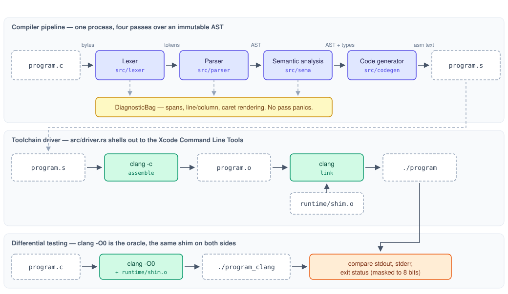

# Rusty C Compiler: Architecture

A compiler is a program that turns text a person can read into instructions a machine can run. This
one does that for a small, precisely bounded subset of the C language, written in Rust, and produces
a real native executable for Apple Silicon macOS. There is no interpreter standing between the
program and the CPU at run time, no virtual machine, and no translation into some other language as a
stopgap — the output is the same kind of file `clang` or `gcc` would produce.

The motivation and scope are recorded in [`PROPOSAL.md`](PROPOSAL.md); the phased delivery plan and
its GitHub issues are in [`PLAN.md`](PLAN.md). This document explains the design in plain terms
first, then offers a "Dive Deeper" for each section — a collapsible box holding the precise technical
detail (exact instructions, exact grammar, exact edge cases) for anyone who wants it. The reasoning
behind each major choice — the alternatives that were considered and rejected, and why — is recorded
separately as Architectural Decision Records (ADRs) in [`decisions/`](decisions/index.md); each
section below links only to the ADRs relevant to it, rather than repeating their arguments here.

## Outline

- [What this compiler does](#what-this-compiler-does)
- [The pipeline](#the-pipeline)
- [The lexer](#the-lexer)
- [The parser](#the-parser)
- [Semantic analysis](#semantic-analysis)
- [Code generation](#code-generation)
- [The driver](#the-driver)
- [The language subset](#the-language-subset)
- [The runtime shim](#the-runtime-shim)
- [Testing architecture](#testing-architecture)
- [Directory](#directory)
- [Future scope](#future-scope)

## What this compiler does

Building a compiler means answering a question most projects can dodge: what does "correct" even
mean here? The answer this project settles on shapes almost everything else, so it is worth stating
up front.

The source language is a subset of real C — not a small language invented for this project. Because
it is genuinely C, `clang` can compile the exact same program. Run both compilers' output and compare
what happens: same behavior means the compiler did its job, and a mismatch is a bug with a name and a
specific program attached to it. This comparison, called differential testing, is the project's actual
definition of correct, and it is only possible because the input language already has an independent,
trustworthy implementation to compare against.

The implementation language is Rust. A syntax tree is naturally a tree of "this node is one of these
shapes" — which is exactly what a Rust `enum` models, and the compiler catches a missed case at build
time rather than a human catching it in review.

The compiler targets exactly one platform: ARM64 macOS, the machine it is developed on. There is no
attempt to support other chips or operating systems, and no abstraction layer built in anticipation of
one.

None of C is out of scope by accident — the subset is a deliberate boundary, not a todo list. Left out
entirely: the preprocessor (`#include`, `#define`), compiler optimization, register allocation,
multiple compilation targets, compiling more than one file at a time, and the parts of C — full
pointers, `struct`, `union` — that would add a lot of complexity without teaching anything the rest of
the subset doesn't already cover. The exact grammar boundary is in [the language
subset](#the-language-subset) below.

??? info "Relevant ADRs"
    - [ADR 0001 — Compile a subset of C, with clang as the testing oracle](decisions/0001-subset-of-c-with-clang-as-oracle.md)
    - [ADR 0002 — Rust as the implementation language](decisions/0002-rust-as-implementation-language.md)
    - [ADR 0003 — One target: ARM64 macOS, with no portability layer](decisions/0003-single-target-arm64-macos.md)

## The pipeline

At the highest level, the compiler is an assembly line. A source file goes in one end; each station
along the line hands off a more machine-shaped version of it to the next, until a real, runnable
program comes out the other end:

```
program.c → tokens → AST → typed AST → ARM64 assembly → object file → executable
```

Each station — lexer, parser, semantic analyzer, code generator — does exactly one job and only ever
talks to the station next to it, through one clearly defined shape of data. Nothing loops back to an
earlier station. That sounds like a small detail, but it is what keeps a bug from hiding: a station
that cannot see what an earlier station did cannot accidentally paper over that station's mistake, so
a bug stays visible in the place that caused it.



Two rules hold across every station on the line, and they are worth understanding even without the
technical detail: once the parser builds the program's tree structure, nothing downstream is allowed
to edit it — later stations attach their findings alongside it instead of scribbling on it. And no
station is ever allowed to crash; every problem it finds becomes a reported error instead, and it
keeps looking for more rather than stopping at the first one.

??? note "Dive Deeper: pipeline invariants"
    --8<-- "docs/dive-deep/pipeline.md"

??? info "Relevant ADRs"
    - [ADR 0004 — An immutable AST, annotated through side tables](decisions/0004-immutable-ast-with-side-table-annotations.md)

## The lexer

Before a computer can understand a program's structure, it first has to break the raw text into
meaningful pieces — the way a person reads a sentence as words rather than a wall of letters. That is
the lexer's whole job: it turns a stream of characters into a list of tokens like `int`, `x`, `=`,
`5`, `;`, each one tagged with what it is. It has no opinion about what any of it means; it does not
know that `x = 5;` is an assignment, only that `x`, `=`, `5`, and `;` are four distinct, recognizable
pieces.

Getting this step right matters more than it looks like it should. A lexer has to know that `<=` is
one token and not the two tokens `<` and `=` glued together, that `integer` is one identifier and not
the keyword `int` followed by leftover letters, and that text inside `/* ... */` is not code at all.

??? note "Dive Deeper: the lexer"
    --8<-- "docs/dive-deep/lexer.md"

## The parser

Once the program is a list of tokens, the parser's job is to discover the structure those tokens
imply — which expression sits inside which statement, which statement sits inside which function, and
critically, what a piece of arithmetic actually means. `1 + 2 * 3` is not ambiguous to a person who
learned order of operations in school, but a computer only knows that if something tells it: this has
to mean `1 + (2 * 3)`, not `(1 + 2) * 3`. The parser's output is a tree — an Abstract Syntax Tree, or
AST — that makes this grouping explicit and unambiguous.

The technique used here is called recursive descent: roughly, one small function per rule in [the
language's grammar](#the-language-subset), each calling the functions for the rules nested inside it.
It is the most direct way to turn a grammar into working code, which is part of why the grammar and
the parser read as mirrors of each other.

The parser also has to cope with mistakes. A program with a typo should not make the whole compiler
give up after the first error — it should report the mistake clearly and keep looking for others, the
way a spell-checker underlines one misspelling without refusing to check the rest of the document.

??? note "Dive Deeper: the parser"
    --8<-- "docs/dive-deep/parser.md"

## Semantic analysis

The parser only checks that a program is *written* correctly — that the punctuation and structure
follow the rules. It has no idea whether the program *makes sense*. Semantic analysis is the step that
asks that question: is this variable declared before it's used? Is this function being called with the
right number of arguments? Is `int` being assigned into something that only holds an array? A program
can be perfectly well-formed and still be nonsense, the way "the square root ate my homework" is a
grammatically valid English sentence that means nothing.

This step also decides what every value's type is and where every variable actually lives — decisions
the code generator later relies on completely rather than re-deriving. Answering those questions once,
carefully, in one place, is what lets the next stage skip asking them at all.

??? note "Dive Deeper: semantic analysis"
    --8<-- "docs/dive-deep/semantic-analysis.md"

??? info "Relevant ADRs"
    - [ADR 0004 — An immutable AST, annotated through side tables](decisions/0004-immutable-ast-with-side-table-annotations.md)
    - [ADR 0008 — Reject undefined behavior rather than admit it](decisions/0008-reject-undefined-behavior.md)

## Code generation

This is the stage that actually produces ARM64 assembly — the literal instructions the processor will
execute. Everything before this point has been about understanding the program; this is where the
compiler commits to a specific way of running it.

The approach taken here is deliberately the simple one. A real, mature compiler assigns frequently
used values to the CPU's fast registers and only falls back to slower main memory when it runs out of
registers — a genuinely hard scheduling problem called register allocation. This compiler skips that
problem entirely: every variable and every intermediate result in a calculation gets a fixed, permanent
spot on the function's stack (a region of memory set aside for it), and a value is only pulled into a
register for the instant it is actually being used. This is slower than what a production compiler
would generate, and that trade is made on purpose — it removes an entire category of extremely subtle
bug (a value silently overwritten because two things were assigned the same register) in exchange for
code that runs correctly, if not quickly.

The output of this stage is also where C's specific, sometimes quirky rules get made concrete: how a
1-byte `char` behaves like a 4-byte `int` in a calculation, how a comparison like `a < b` becomes an
actual 0-or-1 value, how array indexing turns into a memory address. The full list of these is in the
dive-deeper below.

??? note "Dive Deeper: code generation"
    --8<-- "docs/dive-deep/code-generation.md"

??? info "Relevant ADRs"
    - [ADR 0005 — Stack spilling instead of register allocation](decisions/0005-stack-spilling-instead-of-register-allocation.md)

## The driver

Everything above turns a `.c` file into assembly text — but assembly text is not a runnable program
yet. The driver is what closes that gap: it is the part that makes `rustycc program.c -o program` behave
like an ordinary compiler rather than a tool that prints assembly and stops.

Concretely, it hands the generated assembly to `clang` to turn into an object file, hands that object
file to `clang` again along with a small runtime helper (see [the runtime shim](#the-runtime-shim)) to
link into a finished executable, and cleans up after itself. `clang` does the assembling and linking
rather than this project reimplementing that step, because knowing exactly where macOS keeps its
system libraries and startup files is its own significant, ever-shifting body of knowledge that has
nothing to do with learning how compilers work.

??? note "Dive Deeper: the driver"
    --8<-- "docs/dive-deep/driver.md"

??? info "Relevant ADRs"
    - [ADR 0009 — Drive the toolchain through clang, not as and ld](decisions/0009-clang-as-assembler-and-linker.md)

## The language subset

A grammar is a set of rules for what counts as a valid sentence in a language — for a programming
language, it is the contract that says exactly which programs the compiler accepts. It matters more
than it might sound like it should: the parser accepts exactly what the grammar describes, and every
other stage handles exactly what the parser is able to produce. If the grammar changes, every stage
downstream of it changes with it, which is why it is written down explicitly rather than left implicit
in the parser's code.

The grammar is layered by precedence — assignment at the loosest-binding end, down through the
familiar operators, to parentheses and literals at the tightest-binding end — which is the formal way
of encoding the same rule taught in school arithmetic: multiplication before addition, and so on for
every operator this subset supports. The full grammar, written out rule by rule, is in the
dive-deeper below, along with the handful of semantic rules — like `char` behaving as `int` during
arithmetic — that more than one compiler stage has to agree on, and the complete list of standard C
features this subset deliberately does not include.

??? note "Dive Deeper: the full grammar and its edge cases"
    --8<-- "docs/dive-deep/language-subset.md"

??? info "Relevant ADRs"
    - [ADR 0001 — Compile a subset of C, with clang as the testing oracle](decisions/0001-subset-of-c-with-clang-as-oracle.md)
    - [ADR 0007 — Array-to-pointer decay only at the function-parameter boundary](decisions/0007-array-decay-only-at-parameter-boundary.md)

## The runtime shim

A compiled program that cannot print anything is nearly untestable — there would be nothing to
compare beyond a single numeric exit code. The obvious answer, C's `printf`, turns out to be a poor
fit here: it accepts a variable number of arguments, and passing a variable number of arguments on
ARM64 follows its own distinct set of rules that would need a whole separate implementation effort to
support correctly, for a feature that exists only to make output prettier, not to test the compiler
better.

Instead, this project ships a tiny helper library — three simple functions, `print_int`, `print_char`,
and `print_string`, each taking exactly one argument — compiled once and linked into every test
program the same way on both sides of the comparison with `clang`. That keeps output simple, keeps it
unambiguous, and keeps it identical in both binaries being compared.

??? note "Dive Deeper: the runtime shim"
    --8<-- "docs/dive-deep/runtime-shim.md"

??? info "Relevant ADRs"
    - [ADR 0006 — A fixed-arity runtime shim instead of printf](decisions/0006-fixed-arity-runtime-shim.md)

## Testing architecture

Testing is not something this project does once the compiler is "done" — it is the reason C was
chosen as the input language in the first place. Every program the compiler is asked to build is also
built by `clang`; both resulting programs are actually run, and their output and exit status are
compared byte for byte. Agreement is evidence of correctness that does not depend on trusting the
author's own assumptions about what a program should do, because the author didn't write the
expected answer down — `clang` did, just by being run.

Beneath that headline idea sit several layers of testing that each catch a different class of mistake:
small in-code unit tests, saved-output snapshot tests for things like the parsed tree structure, and a
random-program generator that feeds the differential comparison programs no human thought to write by
hand. A separate fuzzing tool feeds the front end raw, arbitrary bytes to make sure it never crashes,
only ever reports an error or succeeds.

??? note "Dive Deeper: the full testing strategy"
    --8<-- "docs/dive-deep/testing.md"

??? info "Relevant ADRs"
    - [ADR 0001 — Compile a subset of C, with clang as the testing oracle](decisions/0001-subset-of-c-with-clang-as-oracle.md)
    - [ADR 0008 — Reject undefined behavior rather than admit it](decisions/0008-reject-undefined-behavior.md)

## Directory

```text
rusty_c_compiler/
├── AGENTS.md                   # conventions and working rules for this repo
├── README.md
├── Cargo.toml
├── rust-toolchain.toml         # pinned stable toolchain
├── mkdocs.yml                  # documentation site config
├── requirements-docs.txt       # documentation site dependencies
├── .github/workflows/ci.yml    # fmt, clippy, test, differential; scheduled fuzz
├── grammar/
│   └── syntax.ebnf             # the language subset grammar — embedded, not duplicated, into architecture.md
├── docs/
│   ├── index.md                # site landing page
│   ├── architecture.md         # this document
│   ├── dive-deep/              # per-section technical detail, embedded into architecture.md, excluded
│   │                           # from the built site as standalone pages (see mkdocs.yml)
│   ├── PRAGMATIC_TESTING.md    # Rex Black's testing concepts mapped onto this project
│   ├── PROPOSAL.md             # original project proposal
│   ├── PLAN.md                 # phased delivery plan, mapped to GitHub issues
│   ├── decisions/              # ADRs — 0001-subset-of-c-with-clang-as-oracle.md, …
│   └── assets/
│       └── architecture.svg
├── runtime/
│   └── shim.c                  # print_int / print_char / print_string
├── src/
│   ├── main.rs                 # argv parsing, exit codes
│   ├── lib.rs                  # public compile() entry point
│   ├── diagnostics.rs          # Span, SourceMap, Diagnostic, DiagnosticBag, renderer
│   ├── lexer/
│   │   ├── mod.rs              # byte scanner, literal decoding, resynchronization
│   │   └── token.rs            # TokenKind, Token, keyword table
│   ├── ast.rs                  # node types, NodeId, spans — immutable after parsing
│   ├── parser/
│   │   ├── mod.rs              # declarations, statements, error recovery
│   │   └── expr.rs             # precedence climbing, postfix loop
│   ├── sema/
│   │   ├── mod.rs              # two-pass analyzer, annotation output
│   │   ├── scope.rs            # scope stack, symbol table
│   │   └── types.rs            # Ty, promotion, decay, compatibility
│   ├── codegen/
│   │   ├── mod.rs              # per-function driving of the lowering
│   │   ├── frame.rs            # stack layout, slot assignment, prologue/epilogue
│   │   ├── expr.rs             # expression lowering
│   │   ├── stmt.rs             # statements, control flow, loop-context stack
│   │   └── emit.rs             # assembly buffer, sections, labels, symbol naming
│   └── driver.rs               # assemble and link via the system toolchain
├── tests/
│   ├── programs/               # subset-C corpus, one feature area per file
│   │   ├── COVERAGE.md         # feature-to-program matrix
│   │   └── invalid/            # programs that must be rejected, with the rule each violates
│   ├── lexer_snapshots.rs
│   ├── parser_snapshots.rs
│   ├── sema_errors.rs
│   ├── codegen_exec.rs
│   ├── codegen_snapshots.rs
│   └── differential.rs         # the clang oracle harness
└── fuzz/
    └── fuzz_targets/
        ├── lex.rs
        ├── parse.rs
        └── frontend.rs
```

## Future scope

None of this is planned work; it is the set of directions the current structure deliberately leaves
open.

A real intermediate representation. The code generator currently walks the typed AST directly, which
is why it is tied to one target. Introducing an IR between analysis and emission is the change that
would make both optimization and retargeting possible, and it is the natural next structural move.

Register allocation. With an IR in place, replacing stack spilling with linear-scan or
graph-coloring allocation becomes a self-contained project with an unambiguous success metric: the
differential suite must stay green while the generated code gets faster. The existing corpus becomes
the safety net for exactly the kind of change that is otherwise terrifying.

A second target. x86-64 macOS or ARM64 Linux would force the target-specific assumptions currently
spread through `codegen/` behind an interface. The differential harness generalizes to it directly,
since `clang` is the oracle on any platform it runs on.

More of C. Full pointers, `struct`, and `switch` are each a bounded extension to the grammar, the
type model, and the backend, in that order. The grammar in [the language subset](#the-language-subset)
is the place each one would start.

A preprocessor. Explicitly excluded here, and a self-contained project of its own — it is a separate
language operating on token streams before the compiler proper begins, which is exactly why it makes
a clean later addition rather than a retrofit.
