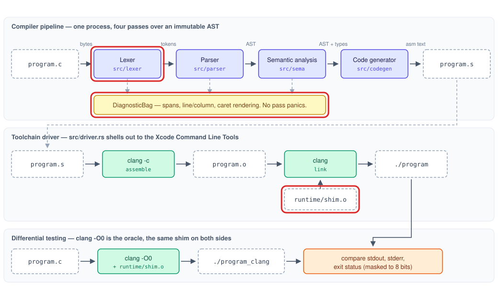

# Phase 1: Foundation, diagnostics, and the lexer

## Goal

A working Cargo project that can turn a source file into a token stream, with a diagnostic
system good enough to serve every later phase, plus the CI and runtime-shim infrastructure the whole
project depends on.

## Outline

- [What Was](#what-was)
- [Overview](#overview)
- [Components](#components)
    - [Positions](#positions)
    - [Tokens](#tokens)
    - [Scanner](#scanner)
    - [Runtime Shim](#runtime-shim)
    - [Scaffolding](#scaffolding)
- [Learnings](#learnings)
- [Try It Out](#try-it-out)
- [What's Next?](#whats-next)

## What Was

Before Phase 1 the project consisted of documents only:

- The [architecture](../architecture.md): the design of the finished compiler, its pipeline of
  stages, and the grammar of the accepted C subset.
- Nine [ADRs](../decisions/index.md) (Architectural Decision Records), each capturing one binding
  decision, the alternatives rejected, and the reasoning.
- The [implementation plan](../PLAN.md): the five phases, their deliverables, and their exit
  criteria.

There was no Cargo project, no source code, no tests, and no continuous integration.

## Overview

Phase 1 builds the first stage of the compiler and the infrastructure every later stage depends on.

- The lexer turns the bytes of a C file into a stream of tokens.
- The diagnostic system gives every stage one way to record a problem at a byte position and render it with a caret under the offending
text.
- The runtime shim provides the output functions compiled programs link against.
    - A program built by `rustycc` and the same program built by `clang` can be run and compared.
    - The project's definition of correctness, recorded in [ADR 0001](../decisions/0001-subset-of-c-with-clang-as-oracle.md).
- The phase also sets up the crate, the command line, the lint rules, and CI.

The parts of the [architecture](../architecture.md#the-pipeline) this phase builds are outlined in
red:



## Components

Phase 1 is the first phase, so every component is new:

| Component | Role |
|---|---|
| [Positions](#positions) | Byte spans, line and column lookup, diagnostics, and their rendering |
| [Tokens](#tokens) | The vocabulary shared by the lexer and the parser |
| [Scanner](#scanner) | Source bytes to a token stream, plus `--dump-tokens` |
| [Runtime Shim](#runtime-shim) | The output functions compiled programs link against |
| [Scaffolding](#scaffolding) | The structure every later phase builds inside |

### Positions

Positions are used by every stage of the compiler. This component defines how a position is
recorded and how a problem at that position is reported.

#### Span (`src/diagnostics.rs`)

```rust
pub struct Span {
    pub start: usize, // offset of the first byte
    pub end: usize,   // offset one past the last byte
}
```

A `Span` is a half-open byte range — it includes `start` and excludes `end`. Byte offsets are used
instead of line and column numbers for three reasons:

- An offset is a single integer, so comparing two positions is one comparison.
- Joining two spans into one that covers both, which the parser does constantly, is `min` and
  `max` arithmetic (`Span::to`).
- Line and column depend on how the file is divided into lines and are expensive to compute. They
  are needed only when a message is displayed.

A reversed range is clamped to empty rather than rejected, so a miscalculated end offset produces a
harmless position instead of a crash.

The conversion to line and column belongs to `SourceMap`, which records the offset at which each
line begins when it is created. Converting an offset is then a binary search over that list: the
search repeatedly halves the candidate range instead of counting newlines from the start of the file.
The result is a `Location { line, column }`. Both numbers are 1-based, and columns are counted in
bytes to match `clang`.

> Every stage needs the source file, for scanning it or for quoting a line in a message, and copying
> it into each would waste memory while a raw pointer to it could outlive the buffer. Rust lifetimes
> let the file be shared without either risk:
>
> - `SourceMap<'source>` and the lexer hold `&'source [u8]`, a borrowed view of the bytes the caller
>   read, rather than their own copy.
> - The `'source` lifetime ties each borrow to the original buffer, and the Rust compiler rejects any
>   code in which a `SourceMap` could still be in use after that buffer is gone.
> - The check happens entirely at compile time, so sharing costs nothing at run time.

#### Diagnostic (`src/diagnostics.rs`)

```rust
pub struct Diagnostic {
    pub kind: DiagnosticKind, // Lex, Parse, Semantic, or Internal
    pub message: String,      // the one-line description after `error:`
    pub span: Span,           // where the problem is
    pub notes: Vec<String>,   // further context printed beneath
}
```

A diagnostic is a compiler's report about a problem in the program it is compiling.

- `kind` records which stage reported the problem. Keeping it as a field, rather than in the
  wording, lets a test assert that the lexer reported an error without depending on the exact
  message text, which is free to improve.
- `notes` carry the remedy. The message states what is wrong, and a note states what to do instead.
  For example, an oversized literal reports the problem, and its note gives the maximum and the
  portable spelling of the minimum, `-2147483647 - 1`.

`SourceMap::render` produces the displayed form:

```
/tmp/errors.c:1:9: error: expected digits after '0x'
int a = 0x;
        ^~
```

The layout matches `clang`'s:

- The path, line, and column.
- The message.
- The offending source line.
- A caret line underneath, marking the exact bytes at fault.

Three details of the caret line prevent misplaced carets:

1. Tabs are reproduced as tabs. Padding a tab-indented line with spaces would shift the caret by a
   distance that depends on the terminal's tab width.
2. UTF-8 continuation bytes are skipped when padding. A character outside ASCII occupies several
   bytes, but it should cost the caret one position, not several.
3. The underline is clamped to the end of the printed line and is never narrower than one `^`. A
   span that continues onto later lines is underlined only on its first line, and an empty span —
   something missing at a position — still receives a marker.

#### DiagnosticBag (`src/diagnostics.rs`)

```rust
pub struct DiagnosticBag {
    diagnostics: Vec<Diagnostic>,
}
```

A stage pushes each problem into a `DiagnosticBag` and continues, so a file with four mistakes
produces four diagnostics. `into_sorted` returns them in source order, because a stage does not
necessarily find problems in the order they occur — a later stage may resolve a reference and only
then find an error on an earlier line. The sort is stable: two diagnostics at the same position keep
the order in which they were found.

### Tokens

A token is the smallest meaningful unit of a program. `int x = 5;` consists of five tokens:

- The keyword `int`.
- The identifier `x`.
- The operator `=`.
- The integer literal `5`.
- The punctuator `;`.

The lexer produces these tokens without interpreting them; it does not know the sequence is a
declaration.

#### Token (`src/lexer/token.rs`)

```rust
pub struct Token {
    pub kind: TokenKind, // what the token is
    pub span: Span,      // where it came from
}
```

The vocabulary covers the entire grammar, not only what the scanner recognized when it was written,
because the token set is the contract between the lexer and the parser.

#### TokenKind (`src/lexer/token.rs`)

```rust
pub enum TokenKind {
    Keyword(Keyword),   // int, char, void, if, else, while, for, return, break, continue
    Ident(String),      // a name that is not a keyword
    IntLit(i32),        // 0xff arrives as 255
    CharLit(u8),        // '\n' arrives as the byte 10
    StrLit(Vec<u8>),    // "a\tb" arrives as three bytes, with a real tab
    Plus, PlusPlus, LtEq, AmpAmp, /* … every operator and punctuator … */
    Eof,                // the end of the stream
}
```

The variants that carry data store it already decoded: the lexer resolves numeric bases and escape
sequences once, in the only stage that reads the source text. No later stage re-interprets a
backslash, which rules out two stages disagreeing about what an escape means.

> A token is one of several alternatives, and only some alternatives carry a value. Rust's `enum`
> models exactly that shape:
>
> - Each variant can carry its own data, of its own type: `IntLit(i32)`, `StrLit(Vec<u8>)`, or nothing
>   at all for `Plus`.
> - The value inside a variant can only be read by first matching on which variant it is, so code can
>   never read a string's bytes out of a token that is actually an integer.
> - Without this, a token is a kind tag plus a general-purpose field, and every stage must remember
>   which tags make that field meaningful.

The cost is that `Token` owns heap-allocated data (`String`, `Vec<u8>`), so it cannot be `Copy` —
duplicated implicitly, like an integer — and must be duplicated with an explicit `clone()`. The type's
documentation records this trade-off.

#### Reading and Writing (`src/lexer/token.rs`)

Two pieces of knowledge are needed in both directions: reading source text into a token, and
writing a token back out as source text for an error message. Each is defined once so that the two
directions cannot disagree.

- Keywords are declared once, in the `keywords!` macro, which provides the `Keyword` enum,
  `Keyword::from_identifier` (text to keyword), and `Keyword::spelling` (keyword to text).
- Escape sequences live in one table, `ESCAPES`, of eleven `(letter, byte)` pairs. The lexer reads it
  left to right to decode `\n` into byte 10, and the display code reads it right to left to write
  byte 10 back as `\n`. A test checks the round trip for every entry.

Every `TokenKind` has a display spelling. That is what allows a later diagnostic to read
`expected ';', found '}'` in the programmer's own notation.

> Without code generation, the keyword enum, the lookup from text, and the spelling function are
> three lists maintained by hand, and the first keyword added to one but not the others is a bug.
> A declarative macro (`macro_rules!`) is Rust code that writes code at compile time:
>
> - `keywords!` takes a single list of `Variant => "spelling"` pairs.
> - It expands into the enum, a `Keyword::ALL` constant, and the two `match` functions.
> - Adding a keyword is one line, and the directions cannot disagree because both are generated
>   from that line.

#### Token Testing (`src/lexer/token.rs`)

The test module has to prove that every token kind has a spelling, including kinds added later.
A plain list of sample tokens cannot prove this, because a new variant could be left out of the
list and go untested without any failure.

The sample function therefore matches each sample against every variant of `TokenKind`, and
`TokenKind::fixed_spelling` is written the same way. A second test asserts that no two samples are
the same variant, so the list cannot satisfy the first test by repeating an entry.

> A Rust `match` over an enum must handle every variant; the compiler rejects one that does not.
> Both the sample function and `fixed_spelling` rely on this:
>
> - Adding a `TokenKind` variant without a sample stops the test suite from compiling, at the
>   exact line where the case is missing.
> - Adding one without a spelling stops the compiler itself from building, so a token with no
>   spelling can never reach an error message as blank text.

### Scanner

The scanner is the lexer's implementation: the loop that reads bytes and emits tokens.

#### Interface (`src/lexer/mod.rs`)

```rust
pub struct Lexed {
    pub tokens: Vec<Token>,           // always ends in Eof
    pub diagnostics: Vec<Diagnostic>, // in source order
}

pub fn lex(source: &[u8]) -> Lexed;
pub fn dump(map: &SourceMap, tokens: &[Token]) -> String;
```

#### Principles (`src/lexer/mod.rs`)

The scanner reads `&[u8]`, a slice of raw bytes, rather than text:

1. A C file is not guaranteed to be valid UTF-8; a single corrupted byte is enough to break that
   guarantee.
2. The lexer is a planned fuzzing target. A fuzzer searches for crashes by generating arbitrary
   input, most of which is not valid text.
3. Converting to text first would turn a malformed byte into a failure before compilation starts.
   Reading bytes turns it into an ordinary diagnostic that points at the byte.

Two properties hold for every input, as the module documentation states:

1. It terminates. Each step consumes at least one byte before deciding what it has scanned, so the
   offset only increases and no input can make the loop repeat in place. This follows from the
   structure of the code: `scan` receives its first byte already consumed.
2. It reaches the end. A malformed construct produces a diagnostic and the scanner resynchronizes,
   meaning it resumes at a defined point instead of stopping. The token stream always ends in `Eof`.
   This is what makes the parser's error recovery testable, since the parser still receives the
   tokens after a lexical error.

Resynchronization points are chosen per construct:

- An unterminated string or character literal resumes at the end of its line, since a missing
  closing quote is far more likely than a literal meant to span lines.
- An unterminated block comment consumes the rest of the file. No other resumption point is
  defensible, and closing the comment early would silently turn comment text into code.

#### Maximal Munch (`src/lexer/mod.rs`)

At each position the scanner takes the longest sequence of characters that forms a valid token.
This rule is called maximal munch.

- `<=` is always one token, never `<` followed by `=`.
- `a+++b` scans as `a`, `++`, `+`, `b`: at the second character the longest match is `++`, and at
  the fourth it is `+`.

The tests assert the exact token sequence for `a<=b`, `a<-b`, `a++ +b`, and `a+++b`. Counting tokens
would prove nothing here, because the incorrect split of `a+++b` also produces four tokens.

#### Keywords (`src/lexer/mod.rs`)

Checking whether the input starts with `int` would scan `integer` as the keyword `int` followed by
an identifier `eger`. The scanner avoids this by reading the complete word first — every letter,
digit, and underscore in sequence — and only then calling `Keyword::from_identifier` on the finished
word. `integer` is not in the table, so it becomes a single identifier.

#### Numbers (`src/lexer/mod.rs`)

C writes integers in three bases: decimal, hexadecimal with a `0x` prefix, and octal with a leading
`0`. Two rules govern malformed and oversized literals:

1. The whole literal is consumed before it is validated. The scanner reads the entire run of
   letters and digits, so `0xZZ` and `123abc` each produce one diagnostic covering the whole
   literal, not an error followed by an unrelated identifier.
2. Overflow is a diagnostic, not a wrap. Literals are accepted up to `i32::MAX`, 2147483647.
   Accumulation saturates, so a very long literal cannot wrap back into the valid range partway
   through. The minimum `int` is written `-2147483647 - 1`, which is also how `limits.h` defines
   `INT_MIN`.

#### Token Dump (`src/lexer/mod.rs`)

`rustycc program.c --dump-tokens` prints the stream one token per line, each preceded by its source
range. For `int x = 0xff;`:

```
1:1-1:4    Keyword(Int)
1:5-1:6    Ident("x")
1:7-1:8    Assign
1:9-1:13   IntLit(255)
1:13-1:14  Semi
2:1-2:1    Eof
```

Kinds are printed in Rust's debug format (`Debug`), not as source text, because the dump exists to
show what the scanner decided: `IntLit(255)` for `0xff` shows that the base was decoded. The two
byte-valued literals are shown re-escaped, as `CharLit('\n')`, instead of as raw numbers. As
[Learnings](#learnings) describes, the width of the position column is measured from the data.

### Runtime Shim

A compiled program with no output can be compared only by its exit code, a single integer. Useful
differential testing needs printed output. C's `printf` is unsuitable for two independent reasons,
recorded in [ADR 0006](../decisions/0006-fixed-arity-runtime-shim.md):

1. `printf` is variadic — it accepts a variable number of arguments. On ARM64, variadic arguments
   are passed under different rules from fixed arguments, and supporting them would be significant
   work spent on output rather than on the compiler.
2. `printf` buffers its output, so two binaries could write at different moments and differ for
   reasons unrelated to either compiler.

#### Output Functions (`runtime/shim.c`)

The shim instead defines three functions, each with exactly one argument:

```c
void print_int(int n);
void print_char(char c);
void print_string(char *s);
```

The file is compiled by `clang`, not by `rustycc`, so it may use the headers and preprocessor the
subset excludes. The [architecture](../architecture.md#the-runtime-shim) describes its role in the
pipeline. Three details guard against specific failures:

1. Writes are retried. The `write` system call may write fewer bytes than requested, or be
   interrupted by a signal (`EINTR`), so `write_all` loops until every byte is written.
2. `print_int` computes digits in unsigned arithmetic. Negating the most negative `int` overflows,
   which C defines as undefined behaviour — the compiler may then produce anything. The magnitude is
   computed as `0u - (unsigned int)n`, which wraps by definition and yields exactly 2147483648 for
   `INT_MIN`.
3. The digit loop is a `do`/`while`, so zero prints as `0` rather than as nothing.

#### Build Script (`build.rs`, `src/runtime.rs`)

A Cargo build script is a Rust program Cargo runs before compiling the crate. This one invokes
`clang -Werror` once to produce `shim.o`, and exports that object's path as the environment variable
`RUSTYCC_SHIM_OBJECT`. The crate exposes the path as a constant:

```rust
pub const SHIM_OBJECT: &str = env!("RUSTYCC_SHIM_OBJECT");
```

There is one object per build, so both sides of every differential comparison link the identical
runtime. `clang` is also the project's assembler and linker, as
[ADR 0009](../decisions/0009-clang-as-assembler-and-linker.md) records.

> The compiler depends on a C file that only `clang` can build, and a path to it that must be
> correct everywhere the runtime is linked. Cargo and the `env!` macro make that part of the build:
>
> - `build.rs` declares `cargo::rerun-if-changed=runtime/shim.c`, so editing the shim rebuilds it
>   on the next `cargo build` with no separate step.
> - `env!` reads an environment variable when the crate compiles, not when it runs. If the build
>   script did not produce the object, `rustycc` fails to compile rather than failing later at
>   link time.

### Scaffolding

The remaining decisions in Phase 1 compile nothing. They define the structure each later phase
works inside.

#### Library and Binary (`src/lib.rs`, `src/main.rs`)

```rust
pub fn compile(source: &[u8], path: &Path, options: &Options)
    -> Result<Artifacts, Vec<Diagnostic>>;
pub fn run(options: &Options) -> Result<(), Error>;
```

The compiler is a library with a thin binary around it:

- `compile` takes source bytes and returns either artifacts or diagnostics. It reads no files and
  starts no processes.
- `run` adds the input and output around `compile`: reading the file and printing the results.
- The binary's `main` is 23 lines: parse the arguments, call `run`, and convert the result into an
  exit code.

Tests therefore drive the full compiler in-process, which is faster than launching the binary
and gives structured results instead of captured text.

Rust's `Result<T, E>` expresses success or failure in the return type. It holds either a value or an
error, and the caller must handle both. `compile` returns every diagnostic found, not only the first.

#### Command Line (`src/cli.rs`)

```rust
pub enum Stage { Tokens, Ast, Check, Assembly, Executable }
```

The interface is `rustycc program.c -o program`. It is parsed by `clap` (a command-line parsing
library) from annotations on the `Options` struct. Four flags each stop the pipeline at a stage:

- `--dump-tokens`: after the lexer, printing the token stream.
- `--dump-ast`: after the parser, printing the syntax tree.
- `--check`: after semantic analysis, emitting nothing.
- `-S`: after code generation, leaving assembly instead of an executable.

The flags form one mutually exclusive group, so requesting two stopping points is a usage error.
The full set was declared in Phase 1 so that later
phases implement stages behind a fixed interface.

#### Lint Gates (`Cargo.toml`, `clippy.toml`, `src/lib.rs`)

One of the [pipeline invariants](../architecture.md#the-pipeline) is that no stage panics on user
input: every problem must become a diagnostic. Four `clippy` lints (`clippy` is Rust's official linter) enforce it at build time:

```toml
[lints.clippy]
unwrap_used = "deny"
expect_used = "deny"
panic = "deny"
indexing_slicing = "deny"
```

The clippy configuration permits these operations in tests, where a crash is simply a failing test.

> A compiler has to turn every problem in its input into a diagnostic. In Rust, the operations that
> stop the program on unexpected input are a short, identifiable list, and each has a safe
> counterpart whose result the compiler forces the caller to handle:
>
> - `unwrap` and `expect` stop on a missing value; matching the `Option` or `Result` handles it.
> - `panic!` stops explicitly; returning an error value reports it instead.
> - `slice[i]` stops when `i` is out of range; `slice.get(i)` returns `None`, so reading past the
>   end of a file must say what happens there.
>
> Because the list is short, the linter can forbid all of it, and the invariant is checked by
> `cargo clippy` on every build rather than by review.

The crate also declares `#![deny(missing_docs)]`, so a module, type, or function without a
documentation comment fails the build.

#### Toolchain (`rust-toolchain.toml`)

The toolchain file pins Rust to exactly 1.97.1 rather than to the latest stable release. Local
builds and CI therefore use the same compiler and the same lints, and a new Rust release cannot
cause a failure on an unrelated change. Nightly Rust is used only for fuzzing, invoked explicitly as
`cargo +nightly`. [ADR 0002](../decisions/0002-rust-as-implementation-language.md) records why the
compiler is written in Rust.

#### Continuous Integration (`.github/workflows/ci.yml`)

The workflow runs on `macos-14`, an Apple Silicon runner, because the compiler targets
ARM64 macOS only ([ADR 0003](../decisions/0003-single-target-arm64-macos.md)) and later phases run
the code it generates. The workflow is split into separate jobs so that a failure identifies the
gate that failed:

1. Toolchain preflight: asserts that `clang --version` and `xcrun --show-sdk-path` succeed, so a
   missing Xcode installation produces one clear failure instead of a linker error inside another job.
2. `cargo fmt`: formatting.
3. `cargo clippy`: the lint gates, run after the preflight.
4. `cargo test`: the test suite, run after the preflight.
5. `docs`: builds the documentation site and API reference with the same script contributors run
   locally, failing on a broken link or a page missing from the navigation.

## Learnings

Two problems surfaced while building this phase, both in how the scanner turns what it has read
into output. Each one changed the code and gained a test.

1. The token dump's alignment broke on large files. The position column had a fixed width of 16
   characters, which stopped aligning at four-digit line numbers — the file size at which alignment
   matters most. The width is now measured from the widest position in the stream, and a test with
   five-digit line numbers pins that behaviour.
2. An oversized integer literal was quoted incorrectly. The value accumulator saturates (stops at
   its maximum instead of wrapping) so that a long literal cannot wrap back into a valid range, but
   the error message then quoted the saturated number, which never appeared in the source. Writing
   the error-path tests exposed this. The message now quotes the literal's own source text and adds
   a note with the limit.

## Try It Out

Run these from the repository root, with Rust and the Xcode Command Line Tools installed.

1. Build the compiler:

    ```bash
    cargo build
    ```

2. Write a small program and print the tokens the lexer produces:

    ```bash
    cat > /tmp/hello.c <<'EOF'
    int main(void) {
        int total = 0x10 + 010;
        return total;
    }
    EOF
    ./target/debug/rustycc /tmp/hello.c --dump-tokens
    ```

    One token per line with its source position, ending in `Eof`. `0x10` appears decoded as
    `IntLit(16)` and the octal `010` as `IntLit(8)`.

3. Introduce mistakes and read the diagnostics:

    ```bash
    cat > /tmp/broken.c <<'EOF'
    int main(void) {
        int big = 2147483648;
        int a = 0xZZ;
        char c = '';
        return a @ c;
    }
    EOF
    ./target/debug/rustycc /tmp/broken.c --dump-tokens
    ```

    Four errors in source order, each with a caret line under the offending text, and a note on the
    oversized literal giving the limit.

4. Run the runtime shim's tests:

    ```bash
    cargo test --test runtime_shim
    ```

    Six passing tests that compile C programs against the shim and check what they print.

The [Cheatsheet](../CHEATSHEET.md) has more commands for exercising the lexer by hand.

## What's Next?

Phase 1 produces a flat sequence of tokens. [Phase 2](Phase-2-Explanation.md) builds the parser,
which turns that sequence into a tree recording which constructs contain which: the abstract syntax
tree. It builds on each component above:

- The parser reports through `Diagnostic` and `DiagnosticBag`, and adds a `Parse` constructor and
  notes for unsupported C features.
- It consumes the token stream, and uses each `TokenKind`'s spelling in messages such as
  `expected ';', found '}'`.
- It holds the scanner's two properties — terminate, and continue past errors to the end — and adds
  a third: a limit on how deeply the tree may nest.
- It implements `--dump-ast`, the second stage flag declared in Phase 1.
