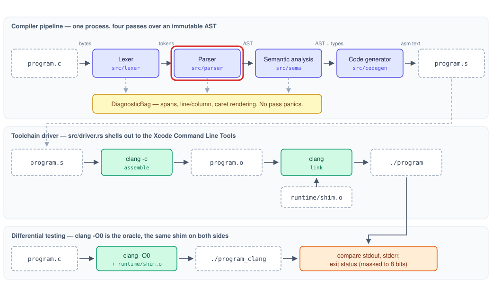

# Phase 2: The AST and the recursive-descent parser

## Goal

Token stream to AST for the entire grammar, with C-correct precedence and associativity and
graceful, recovering error reporting.

## Outline

- [What Was](#what-was)
- [Overview](#overview)
- [Components](#components)
    - [Abstract Syntax Tree](#abstract-syntax-tree)
    - [Parser](#parser)
    - [Unsupported Constructs](#unsupported-constructs)
    - [Test Corpus](#test-corpus)
- [Learnings](#learnings)
- [Try It Out](#try-it-out)
- [What's Next?](#whats-next)

## What Was

[Phase 1](Phase-1-Explanation.md) left the compiler able to read a C file but not to understand it:

- A lexer that turns source bytes into a flat stream of tokens, always ending in `Eof`.
- A diagnostic system: byte-offset spans, a `DiagnosticBag` that collects problems in source order,
  and a renderer that prints each one with a caret under the offending text.
- A runtime shim for compiled programs to print through.
- A library-first crate whose command line already declared `--dump-ast`, with nothing behind it.

A token stream records what each piece of a program is, but not how the pieces relate. For
`int x = 5;` it holds five tokens and no record that `x` is being declared or that `5` is its
initial value.

## Overview

Phase 2 recovers the structure of a program from its tokens.

- The abstract syntax tree (AST) is the data structure that holds that structure: a tree in which
  each construct contains the constructs nested inside it.
    - It is the contract read by the next two stages, semantic analysis and code generation.
    - It is never modified after it is built
      ([ADR 0004](../decisions/0004-immutable-ast-with-side-table-annotations.md)).
- The parser builds the AST from the token stream.
    - It applies C's precedence and associativity, so `1 + 2 * 3` groups as `1 + (2 * 3)`.
    - It reports every syntax error in a file, not only the first, and never crashes or hangs.
- Real C that the subset leaves out, such as `struct` or `+=`, is reported as unsupported rather
  than as a syntax error.
- A corpus of complete C programs, snapshot tests of their trees, and a set of hostile inputs prove
  these properties.

The part of the [architecture](../architecture.md#the-parser) this phase builds is outlined in red:



## Components

| Component | New or extended | Role |
|---|---|---|
| [Abstract Syntax Tree](#abstract-syntax-tree) | New | The node types, their identities, and the tree dump |
| [Parser](#parser) | New | Tokens to AST, with recovery and a nesting limit |
| [Unsupported Constructs](#unsupported-constructs) | Extends Phase 1's diagnostics, tokens, and scanner | Naming real C the subset omits |
| [Test Corpus](#test-corpus) | New | Programs, snapshots, and adversarial inputs |

### Abstract Syntax Tree

A flat token list cannot express grouping. `1 + 2 * 3` is five tokens in a row, and nothing in that
row says the multiplication happens first. A tree does:

```
        +
       / \
      1   *
         / \
        2   3
```

The deeper a node sits, the earlier it is evaluated, so the shape of the tree encodes the order of
operations without a separate rule. The tree is called abstract because it omits what exists only
to help a human read the source: whitespace, and parentheses once their grouping is recorded.

#### NodeId (`src/ast.rs`)

```rust
pub struct NodeId(u32);

pub struct NodeIds {
    next: u32,
}
```

Semantic analysis will need to attach information to nodes, such as the type of every expression.
The AST has no fields for that information. Every node that a later stage can annotate carries a
unique `NodeId` instead, and the analyzer will record its results in separate tables keyed by that
id. [ADR 0004](../decisions/0004-immutable-ast-with-side-table-annotations.md) records the
decision, for two reasons:

- A tree that later stages write into would change every parser snapshot test each time a later
  stage changed, so those tests would stop meaning anything.
- A tree that nothing modifies can be shared by every later stage without any stage observing
  another's changes.

`NodeIds` hands out ids in order: 0, 1, 2, and so on. Its counter saturates instead of overflowing,
so even id allocation cannot crash.

A test enforces that the tree cannot be modified:

```rust
fn require_sync<T: Sync>() {}
require_sync::<Program>();
```

> A rule like "the tree is never modified" is usually a comment that someone eventually ignores.
> Rust can check it at compile time:
>
> - A type is `Sync` when it is safe for several threads to read at once, and Rust works this out
>   automatically from the type's fields.
> - The standard types that allow modification through a shared reference, `Cell` and `RefCell`,
>   are not `Sync`, so any node holding one makes the whole `Program` not `Sync`.
> - A node that quietly gained such a field would make this test fail to compile.
>
> Enforcement of this kind is part of why the compiler is written in Rust
> ([ADR 0002](../decisions/0002-rust-as-implementation-language.md)).

#### Items and Declarations (`src/ast.rs`)

```rust
pub struct Program {
    pub items: Vec<Item>,
}

pub enum Item {
    FuncDef(FuncDef),   // a function with a body
    FuncDecl(FuncDecl), // a function declared without one
    GlobalVar(VarDecl), // a variable at file scope
}

pub struct VarDecl {
    pub id: NodeId,
    pub ty: TypeSpec,
    pub name: Name,
    pub init: Option<Initializer>,
    pub span: Span,
}

pub struct TypeSpec {
    pub base: BaseType,          // Int, Char, or Void
    pub array_len: Option<u32>,  // int a[4]
    pub is_unsized_array: bool,  // int a[] as a parameter
    pub span: Span,
}
```

A node receives an identity only if a later stage can have an opinion about it:

- Items, parameters, declarations, statements, and expressions carry a `NodeId`.
- The type written in a declaration (`TypeSpec`) and the declared name (`Name`) carry a span but no
  id. They are parts of the declaration, not things in their own right.
- A `Block` has no id. A function body belongs to its function, and a nested block belongs to the
  statement that holds it, so a second id would name nothing.

#### Statements (`src/ast.rs`)

```rust
pub struct Stmt {
    pub id: NodeId,
    pub kind: StmtKind,
    pub span: Span,
}

pub enum StmtKind {
    Block(Block),
    If { condition: Expr, then_branch: Box<Stmt>, else_branch: Option<Box<Stmt>> },
    While { condition: Expr, body: Box<Stmt> },
    For { init: Option<Box<ForInit>>, condition: Option<Expr>, step: Option<Expr>, body: Box<Stmt> },
    Return(Option<Expr>),
    Break,
    Continue,
    Expr(Expr),
    LocalVar(VarDecl),
    Empty,
}
```

> A syntax tree is recursive: a statement contains statements, and an expression contains
> expressions. `Box<T>` lets Rust express that directly while managing the memory:
>
> - A Rust type must have a size known at compile time, and a `Stmt` that contained another `Stmt`
>   directly would be infinitely large.
> - `Box<Stmt>` is a pointer to a statement stored on the heap, so the containing node has a fixed,
>   pointer-sized field.
> - Each box is freed automatically when the node that owns it is dropped, so the tree needs no
>   hand-written freeing code, and the enum can still be pattern-matched like any other value.

#### Expressions (`src/ast.rs`)

```rust
pub enum ExprKind {
    IntLit(i32),
    CharLit(u8),
    StrLit(Vec<u8>),
    Ident(String),
    Unary { op: UnOp, operand: Box<Expr> },               // - + ! ++x --x
    Binary { op: BinOp, left: Box<Expr>, right: Box<Expr> },
    Assign { target: Box<Expr>, value: Box<Expr> },
    Index { base: Box<Expr>, index: Box<Expr> },          // a[i]
    Call { callee: Box<Expr>, args: Vec<Expr> },          // f(x, y)
    PostfixIncDec { op: IncDec, operand: Box<Expr> },     // x++ x--
}
```

There is no variant for a parenthesized expression. `((((1))))` produces the same tree as `1`:

- Parentheses tell the parser how to group operands. Once the tree records the grouping, they carry
  no further information.
- Keeping them as nodes would require every later stage to look through them, and one stage
  eventually would not.
- C allows assignment to a parenthesized variable, `(a) = 1`. Because the parentheses leave no node,
  the parser sees a plain identifier on the left and accepts it with no special case.

#### Dump (`src/ast.rs`, `src/lib.rs`)

```rust
pub enum Spans { Hidden, Shown }

pub fn dump(program: &Program, spans: Spans) -> String;
pub fn dump_expression(expr: &Expr, spans: Spans) -> String;
pub fn nodes(program: &Program) -> Vec<(NodeId, Span)>;
```

`dump` renders the tree as an S-expression, a nested parenthesized notation with one node per line.
`rustycc program.c --dump-ast` prints it:

```
(program
  (func-def int main
    (params)
    (block
      (decl-stmt
        (local-var int x
          (init
            (binary +
              (int-lit 1)
              (binary *
                (int-lit 2)
                (int-lit 3))))))
      (return
        (ident x)))))
```

The dump serves three purposes:

- Parser tests assert against it. A test of `1 + 2 * 3` asserts the tree shape, not that the
  program evaluates to 7, because an incorrect grouping can produce the correct value by coincidence.
- `nodes` lists every node's id and span, which is how tests prove that ids are unique and complete
  before semantic analysis relies on them.
- A person can see what the compiler believes a program says.

`dump` and `nodes` share one traversal of the tree, so there is exactly one place that knows the
shape of every node type. That traversal uses exhaustive `match` expressions, so a node type added
without a dump form fails to compile.

### Parser

The parser consumes the token stream and produces the AST. Declarations and statements are in one
file and expressions in another, because the two are parsed with different techniques.

#### Interface (`src/parser/mod.rs`)

```rust
pub struct Parsed {
    pub program: Program,             // complete after a clean parse
    pub diagnostics: Vec<Diagnostic>, // in source order
}

pub fn parse(tokens: &[Token]) -> Parsed;

pub(crate) struct Bail;
```

Every internal parsing function returns `Result<T, Bail>`: the parsed construct, or `Bail`, meaning
the function abandoned the construct and has already recorded a diagnostic explaining why.

#### Recursive Descent (`src/parser/mod.rs`)

Declarations and statements are parsed by recursive descent:

- There is one function per rule in the grammar (`grammar/syntax.ebnf`), and each function calls the
  functions for the rules nested inside it.
- `if_statement` calls `expression` for the condition, then `statement` for the body. That body may
  itself be an `if`, so `statement` calls `if_statement` again — the functions are recursive.
- Parsing starts at the top, `program`, and descends to the smallest constructs.

The three top-level forms — function definition, function declaration, and global variable — share
a prefix: a type followed by a name. `declarator` reads that prefix once, and the next token decides
the form, so the parser never needs to look more than one token ahead.

The structure resolves C's dangling-`else` ambiguity without a rule:

```c
if (a) if (b) x; else y;
```

C attaches the `else` to the nearest `if`. When the inner `if_statement` finishes its body and finds
`else` as the next token, it consumes it, because it is the function currently running. The outer
`if` never sees the `else`.

#### Precedence Climbing (`src/parser/expr.rs`)

The grammar expresses precedence as ten nested rules, loosest operator outermost. Writing one
function per rule would produce six functions differing only in the operators they match and the
function they call next, all of which would need to change together. Instead the parser uses
precedence climbing: one function and one table.

```rust
fn binary_operator(kind: &TokenKind) -> Option<(BinOp, u8)> {
    let (op, precedence) = match kind {
        TokenKind::PipePipe => (BinOp::Or, 1),       // ||  loosest
        TokenKind::AmpAmp => (BinOp::And, 2),        // &&
        TokenKind::EqEq => (BinOp::Equal, 3),        // == !=
        TokenKind::Lt => (BinOp::Less, 4),           // < > <= >=
        TokenKind::Plus => (BinOp::Add, 5),          // + -
        TokenKind::Star => (BinOp::Multiply, 6),     // * / %  tightest
        // ...
        _ => return None,
    };
    Some((op, precedence))
}
```

The algorithm in `binary`:

1. Parse one operand.
2. While the next token is an operator at least as strong as the current minimum, consume it and
   parse the right operand by calling `binary` with a minimum one higher than that operator.
3. Combine the two operands into a `Binary` node, which becomes the left operand for the next pass.

The recursive call in step 2 accepts only operators that bind more tightly, which is what descending
one grammar rule means. The numbers in the table are those rules, counted from the outside.

Associativity follows from the same structure:

- The loop makes binary operators left-associative: `100 - 10 - 1` groups as `(100 - 10) - 1`,
  because each result becomes the next left operand.
- Assignment is right-associative, so `x = y = 9` means `x = (y = 9)`. `assignment` parses the value
  by calling back into `expression` rather than by looping.
- Prefix operators are right-associative too: `- - x` is `-(-x)`.
- Postfix operators — `[]`, `()`, `++`, `--` — are a loop after the primary expression, so they chain
  in any combination, such as `f(x)[0]` or `a[i]++`.

`is_assignable` checks only the shape of an assignment's target: an identifier or an array element.
Whether the target can actually be written to requires types, so semantic analysis decides that.

#### Error Recovery (`src/parser/mod.rs`)

After a syntax error the parser no longer knows where the broken construct ends. It recovers with
panic-mode recovery:

1. Record a diagnostic and return `Bail`, which passes up through every enclosing function.
2. The nearest loop — over the items of the file, or the statements of a block — catches it.
3. `skip_to_boundary` discards tokens up to the next `;`, or up to the `}` that closes the current
   block.
4. Parsing resumes with the next construct.

Two safeguards keep recovery correct:

- Progress is guaranteed. If a construct fails on its very first token, recovery might skip nothing
  and the loop would retry the same token forever. `recover_from` records where the failed construct
  started and, if nothing was skipped, consumes one token itself.
- Braces are counted. A complete `{ ... }` inside the discarded tokens is skipped as a unit, but a `}`
  that closes the block the parser is in is left in place. Consuming it would make one missing
  semicolon swallow the rest of the file.

> Panic-mode recovery has to abandon a construct from deep inside nested parsing calls and resume
> at the nearest loop, without every function in between checking for failure by hand:
>
> - Writing `?` after a call returns early with the callee's error, so `self.expect(&TokenKind::Semi)?`
>   abandons the whole construct in one character.
> - `Bail` is a zero-sized struct: it carries no data and costs nothing to return, because the
>   diagnostic is already recorded.
> - It is a named type rather than `()`, so an abandoned construct cannot be mistaken for a
>   successful empty result.

A missing semicolon in `f` therefore does not hide the problems in `g`:

```
e.c:1:24: error: expected ';', found '}'
int f(void) { return 1 }
                       ^
e.c:2:15: error: unsupported in this C subset: 'struct'
int g(void) { struct point p; return a += 1; }
              ^~~~~~
e.c:2:40: error: unsupported in this C subset: '+='
int g(void) { struct point p; return a += 1; }
                                       ^~
rustycc: 3 errors generated
```

#### Nesting Limit (`src/parser/mod.rs`, `src/parser/expr.rs`)

```rust
pub const MAX_NESTING_DEPTH: usize = 128;

fn nested<T>(&mut self, parse: fn(&mut Self) -> Result<T, Bail>) -> Result<T, Bail>;
fn deepen(&mut self) -> Result<(), Bail>;
fn restoring_depth<T>(&mut self, parse: impl FnOnce(&mut Self) -> Result<T, Bail>) -> Result<T, Bail>;
```

Every function call occupies space on the call stack, a fixed-size region of memory. Two thousand
nested parentheses would exhaust it, and a stack overflow aborts the process — the crash the
[pipeline invariants](../architecture.md#the-pipeline) forbid. The parser therefore limits how deep
the tree may grow and reports `nesting is too deep` past that point:

- `nested` wraps every recursive entry point (`statement`, `expression`, `unary`) and charges one
  level per call.
- `deepen` charges one level for each pass of the loops that deepen the tree without recursing: the
  binary-operator loop and the postfix loop.
- `restoring_depth` returns the charged levels however a construct exits, so a rejected construct
  does not make the code after it appear deeper than it is.

The limit is a measured stack budget. In an unoptimized build, the costliest shape — nested blocks —
needs about 550 KB of stack to parse, dump, and free at the limit. A test parses, dumps, and drops
every deep shape on a deliberately small 1 MiB thread, so a change that enlarges a stack frame fails
that test instead of crashing on a user's file. [Learnings](#learnings) records how the limit
reached this form.

> The depth counter must come back down on every way out of a construct: a normal return, an
> explicit error return, or a `?` failure anywhere inside. Missing one path makes every later
> construct look deeper than it is. A closure makes that guarantee structural:
>
> - `restoring_depth` saves the depth, calls the closure (`impl FnOnce(&mut Self) -> ...`), and
>   restores the depth before returning the closure's result.
> - Every early return inside the closure, including a `?`, only ends the closure, so the restore
>   after it always runs.
> - `nested` is built from `restoring_depth` and `deepen`, so the rule is written in exactly one
>   place.

### Unsupported Constructs

The subset deliberately omits much of C, listed in
[the language subset](../architecture.md#the-language-subset). A program using `struct` is valid C
that this compiler does not implement, not a malformed program, so it should be told that. Every
such construct is reported as `unsupported in this C subset: X`, often with a note suggesting an
alternative. Which stage detects it depends on how the construct is spelled.

#### Unsupported Diagnostic (`src/diagnostics.rs`)

```rust
pub fn unsupported(kind: DiagnosticKind, span: Span, construct: impl fmt::Display) -> Self;
```

This constructor, added to Phase 1's `Diagnostic`, gives the lexer and the parser one phrasing.
Adopting it changed three lexer messages that Phase 1 had pinned with tests:

- `#` had been reported as a stray character. `#include` is real C, so it is now unsupported.
- `&` and `|` had their own wording, `'&' is not supported in this C subset`. They now use the shared
  phrasing.
- A byte that is not C at all, such as `@`, is still a stray character. The distinction is between
  a construct the compiler does not implement and text that is not a program.

#### Keywords (`src/lexer/token.rs`, `src/parser/mod.rs`)

```rust
pub const UNSUPPORTED_KEYWORDS: [&str; 22] = [
    "auto", "case", "const", "default", "do", "double", "enum", "extern", "float", "goto", "long",
    "register", "short", "signed", "sizeof", "static", "struct", "switch", "typedef", "union",
    "unsigned", "volatile",
];
```

Words such as `struct` and `switch` are not keywords in this grammar, so the lexer emits them as
ordinary identifiers.

- The parser consults this list in the single function that rejects a token. Every rejection
  anywhere in the parser therefore reports `unsupported` when that is the accurate description,
  without a check at each call site.
- The list is C89's 32 keywords minus the subset's ten. A test asserts that the two lists together
  are exactly those 32 words, so no word real C reserves can be accepted as a variable name.

#### Operators and Declarators (`src/parser/expr.rs`, `src/parser/mod.rs`)

- Pointer declarators: the `*` in `int *p;` sits between the type and the name. `declarator` reads
  that prefix for all three top-level forms, so it is the one place that detects the `*` and reports
  `pointer declarators`.
- Compound operators: the subset has no `+=` or `<<`, so the lexer emits their halves as separate
  tokens. `adjacent_operator` checks whether two such tokens touch, by comparing the end of the
  first span with the start of the second, and names the combined operator. `a << b` is reported;
  `a < -b` still parses, because its tokens are separated by a space.

#### Punctuation (`src/lexer/mod.rs`)

`#`, `?`, `:`, `^`, `~`, and a lone `&` or `|` are not tokens of this grammar, so nothing reaches the
parser for them. The lexer is the only stage that sees them, so it reports them:

```
q.c:1:11: error: unsupported in this C subset: '?'
int x = a ? 1 : 2;
          ^
note: the conditional operator is not in this subset; use an 'if' statement
```

### Test Corpus

#### Programs (`tests/programs/`)

Five complete, valid C programs, one per feature area: `arithmetic.c`, `control_flow.c`,
`functions.c`, `arrays.c`, and `strings.c`. Each program serves three phases:

- Phase 2: the input to the parser's snapshot tests.
- Phase 4: programs that must compile and run correctly.
- Phase 5: programs compiled by both `rustycc` and `clang`, with the results compared — the
  project's [definition of correctness](../architecture.md#testing-architecture).

`COVERAGE.md` records the purpose of each program and which language features it covers. A test
fails if a `.c` file in the directory has no row, so the corpus cannot accumulate files whose
purpose is unknown.

#### Snapshots (`tests/parser_snapshots.rs`)

Each corpus program's dump is compared against a saved copy, so a parser change appears as a
readable diff of the tree. The saved copies were each read before being accepted, checking the
properties most likely to be wrong while looking correct:

- In `control_flow.c`, the `else` attaches to the inner `if`, and each of the eight `for` clause
  combinations keeps its own slot.
- In `arithmetic.c`, `*` sits below `+`, `100 - 10 - 1` groups leftward, and `x = y = 9` groups
  rightward.

Two properties are tested directly rather than inferred from passing snapshots:

- Every corpus program parses with no diagnostics.
- Dumping the same tree twice produces identical bytes. A snapshot is meaningful only if the dump
  depends on nothing but its input.

#### Hostile Inputs (`tests/parser_no_panic.rs`, `tests/adversarial/`)

A fuzzer, which generates random and mutated input to find crashes, belongs to Phase 5. This phase
approximates it cheaply:

- Truncation: every corpus program is cut short at every token boundary and at every byte, and each
  fragment is parsed. A prefix of a valid program is a construct opened and never closed, which is
  the input most likely to break a parser.
- Missing `Eof`: every token-boundary prefix is also parsed with its trailing `Eof` removed, and must
  produce exactly the same result as with it.
- Adversarial files: ten checked-in inputs aimed at how a parser fails — 2,000 nested parentheses, a
  file of only operators, a 60 KB identifier, an empty file. Files rather than generated strings, so
  a crash found once cannot silently return.

Three rules keep these sweeps meaningful:

- The assertion on a fragment is deliberately weak: it must finish, and may report anything, since
  a fragment is not a program and has no correct answer.
- Every sweep runs under a time limit. A hang does not fail a test on its own; it stalls the suite.
- A separate test confirms a half-finished program is reported, so the sweeps cannot pass against a
  parser that accepts everything.

## Learnings

1. The first nesting limit did not fit the stack. It was set to 256 by analogy with `clang`, then
   measured: 256 levels overflowed a 1 MiB stack, because each level costs roughly 4 KB in an
   unoptimized build. At 256 the guard used about half of a test thread's 2 MiB, so it passed only
   because of that default. A limit that barely fits moves the crash rather than removing it; the
   limit became 128, and a test now runs it on an undersized stack.
2. The limit counted the wrong thing. It counted the parser's recursion, but what exhausts the stack
   is the depth of the tree, because dumping and freeing a tree both recurse once per level. The
   loop that builds `1 + 1 + 1` makes the tree one level deeper per operator without recursing, so a
   10,000-term sum parsed cleanly and then crashed in the dump; at 100,000 terms, freeing the tree
   crashed as well. The same held for postfix chains such as `a[0][0][0]`. Both loops now charge a
   level per pass. Measuring every deep shape also showed nested blocks needed about 550 KB at the
   limit, more than the 512 KB test stack that had only ever been tried with parentheses.
3. A token list without `Eof` made the parser loop forever. Reading past the end returned the last
   real token again, so the `while !at_eof()` loops never ended. Every in-repository caller went
   through the lexer, which always appends `Eof`, so no test saw the case; `parse` is public, and the
   Phase 5 fuzz targets will pass it arbitrary slices. Reading past the end now returns an `Eof` the
   parser owns, placed just after the last token so end-of-file diagnostics still point at the end
   of the file.
4. `nodes()` silently omitted a node. The dump arm for a local declaration returned the inner
   `VarDecl`'s line directly, so the `Stmt` wrapping it — which has its own id and a span that
   includes the `;` — never appeared. The id test checked only that ids were unique, which an
   omission cannot violate. The statement now has its own `decl-stmt` line, and the test requires
   the listed ids to be exactly `0..n`.

## Try It Out

Phase 2 builds on Phase 1, so a single program can be followed through both stages: source text to
tokens, then tokens to a tree. Run these from the repository root, with Rust and the Xcode Command
Line Tools installed.

1. Build the compiler:

    ```bash
    cargo build
    ```

2. Write a small program and print its tokens, the Phase 1 stage:

    ```bash
    cat > /tmp/program.c <<'EOF'
    int main(void) {
        int x = 1 + 2 * 3;
        if (x > 5) x = x - 1; else x = 0;
        return x;
    }
    EOF
    ./target/debug/rustycc /tmp/program.c --dump-tokens
    ```

    A flat list of tokens, with no record of how they group.

3. Print the tree the parser builds from those tokens, the Phase 2 stage:

    ```bash
    ./target/debug/rustycc /tmp/program.c --dump-ast
    ```

    An indented tree in which `*` sits below `+`, and the `if` holds its condition and both branches.

4. Introduce a mistake in each of three functions:

    ```bash
    cat > /tmp/mistakes.c <<'EOF'
    int f(void) {
        return 1
    }

    int g(void) {
        struct point p;
        return 0;
    }

    int h(int a) {
        return a += 1;
    }
    EOF
    ./target/debug/rustycc /tmp/mistakes.c --dump-ast
    ```

    Three errors, one per function: the missing semicolon does not stop the parser, and `struct` and
    `+=` are named as unsupported rather than reported as syntax errors.

5. Run the parser's snapshot and hostile-input tests:

    ```bash
    cargo test --test parser_snapshots --test parser_no_panic
    ```

    Every corpus program's tree matches its saved snapshot, and no truncated or adversarial input
    crashes or hangs.

The [Cheatsheet](../CHEATSHEET.md) has more commands for exercising the parser by hand.

## What's Next?

[Phase 3](../PLAN.md#phase-3--semantic-analysis) adds semantic analysis, which decides whether a
well-formed program also makes sense. It builds on this phase:

- The parser deliberately accepts programs that are well-formed text but ill-formed meaning:
    - using an undeclared variable,
    - calling a function with the wrong number of arguments,
    - assigning an array to an integer.
- The analyzer reads the AST without modifying it, and records types and symbol resolutions in side
  tables keyed by `NodeId`, relying on `nodes()` to enumerate every node.
- It reports through the same `Diagnostic` system, with the `Semantic` kind.
- It walks the tree recursively, so the nesting limit bounds its stack use too.
