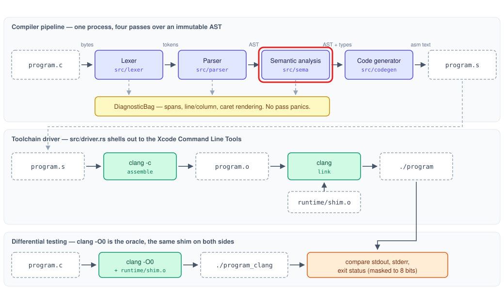

# Phase 3: Semantic analysis

## Goal

Reject every program the code generator cannot correctly compile, and annotate the AST with
everything the code generator needs so that Phase 4 contains no type reasoning.

## Outline

- [What Was](#what-was)
- [Overview](#overview)
- [Components](#components)
    - [Type Model](#type-model)
    - [Scope Stack](#scope-stack)
    - [The Analyzer](#the-analyzer)
    - [Annotations](#annotations)
    - [Diagnostics, Extended](#diagnostics-extended)
    - [The Invalid Corpus](#the-invalid-corpus)
- [Learnings](#learnings)
- [Try It Out](#try-it-out)
- [What's Next?](#whats-next)

## What Was

[Phase 2](Phase-2-Explanation.md) left the compiler able to read a C file and recover its structure:

- An abstract syntax tree (AST) — a tree in which each construct contains the constructs nested
  inside it — covering the whole subset grammar, with C's precedence and associativity applied.
- Every node carrying a span and a `NodeId`, and no field for anything a later stage works out.
- A parser that reports every syntax error in a file rather than the first, and that cannot be made
  to crash or hang.
- A corpus of complete C programs with snapshots of their trees.

A tree records how a program is written. It does not record what any of it means. For
`return helper(1);` the tree holds a call with one argument, and no record of whether `helper`
exists, what it returns, or whether it takes one argument at all. Nothing so far would object to
`int x; x[0] = f(1, 2, 3);` in a file where `f` takes none.

## Overview

Phase 3 decides whether a well-formed program also makes sense, and writes down everything the
backend will need to know about it.

- A type model answers every question about types once, in one place.
    - What storage a type needs, what `char` becomes in arithmetic, what an array becomes at a call,
      and what may be assigned to what.
- A scope stack resolves every identifier to the declaration it refers to.
    - Names nest: the innermost declaration wins, and when its block ends the one it was hiding
      becomes visible again.
- A two-pass walk checks the program against twenty-seven rules.
    - The first pass registers the top level, so a call to a function defined later in the file
      resolves — ordinary C, and impossible in one pass without a forward-reference hack.
    - Each rule has its own message and points at the text that broke it.
- Annotations record what was learned, keyed by `NodeId`, in tables beside the tree rather than on
  it ([ADR 0004](../decisions/0004-immutable-ast-with-side-table-annotations.md)).
    - A type for every expression, a binding for every identifier, the implicit conversions C
      requires, a storage inventory per function, and one entry per distinct string literal.
- A corpus of programs that must stay rejected guards the one direction nothing else covers.

The part of the [architecture](../architecture.md#semantic-analysis) this phase builds is outlined
in red:



## Components

| Component | New or extended | Role |
|---|---|---|
| [Type Model](#type-model) | New | Types and the rules that govern them |
| [Scope Stack](#scope-stack) | New | Resolving a name to its declaration |
| [The Analyzer](#the-analyzer) | New | The two-pass walk and its checks |
| [Annotations](#annotations) | New | What Phase 4 reads instead of re-deriving |
| [Diagnostics, Extended](#diagnostics-extended) | Extends Phase 1's diagnostics | Notes that point at a second place |
| [The Invalid Corpus](#the-invalid-corpus) | Extends Phase 2's corpus | Programs that must stay rejected |

### Type Model

Every type question the rest of the compiler asks is answered in one file. Nothing downstream
repeats the reasoning, which is what lets Phase 4 be a structural walk rather than a second
analyzer.

#### Ty (`src/sema/types.rs`)

```rust
pub enum Ty {
    Int,
    Char,
    Void,
    Error,
    Array(Box<Ty>, u32),
    Ptr(Box<Ty>),
    Func { ret: Box<Ty>, params: Vec<Ty> },
}
```

Two variants need explaining, because neither corresponds to something the subset lets a programmer
write.

`Ptr` has no declarator that produces it — there is no `int *p` in this subset. It exists because
two things genuinely have pointer type: a parameter written `int a[]`, and a string literal passed
to a function. The restriction
([ADR 0007](../decisions/0007-array-decay-only-at-parameter-boundary.md)) is on which expressions
can produce a pointer, not on what the model can represent.

`Error` is recovery. When analysis cannot work out a type — an undeclared name, say — it has already
reported why, and giving that expression a real type would invite a second complaint from whatever
operator it flows into. `Error` satisfies every rule instead, so one mistake produces one message.
[Learnings](#learnings) records why it was added rather than designed in.

#### Layout (`src/sema/types.rs`)

```rust
pub struct Layout {
    pub size: u64,
    pub align: u64,
}

pub fn layout(&self) -> Option<Layout>;
```

How many bytes a value occupies and what boundary it has to start on: one byte for `char`, four for
`int`, eight for a pointer, and for an array its length times its element's size, aligned as its
element is.

`Option` rather than a plain `Layout` because some types have no storage at all. `void` names
nothing, and neither does a function. An array inherits that from its element, which is how
`void a[4]` is caught without a rule of its own.

> An arithmetic overflow is a panic in a debug build, and the pipeline invariants forbid a pass
> crashing on any input. An array of arrays could overflow the multiplication, and `layout` is a
> public function that a caller could reach without going through the parser that refuses to build
> one:
>
> - `checked_mul` returns `Option`, so the overflow has to be handled rather than ignored.
> - The `?` operator turns it into the same `None` that `void` produces, and both mean the same
>   thing to the caller: this names no storage.
> - The result is a total function — every input has an answer — rather than one that is safe only
>   while an upstream pass keeps a promise.

#### Promotion and Decay (`src/sema/types.rs`)

```rust
pub fn promoted(&self) -> Ty;
pub fn decayed(&self) -> Ty;
pub fn common_arithmetic(left: &Ty, right: &Ty) -> Option<Ty>;
```

C computes on integers, not on bytes. A `char` is stored in one byte and promoted to `int` the
moment it takes part in arithmetic, a comparison, or a condition. Storage and computation are
different questions, and separating them here means no later stage has to ask either one.

Decay is the rule that an array becomes a pointer to its first element. In C this happens almost
everywhere; in this subset it happens at one place, the function-argument position, which is what
makes `a + 1` an error rather than pointer arithmetic. `decayed` says what decay produces; it does
not decide where decay is allowed, which is the analyzer's business.

`common_arithmetic` returns `None` for a pairing that has no common type, and that `None` is what
turns into the message about invalid operands.

#### Assignability (`src/sema/types.rs`)

```rust
pub enum Conversion {
    PromoteCharToInt,
    TruncateIntToChar,
    DecayArrayToPtr,
}

pub enum Assignability {
    Exact,
    Converted(Conversion),
    Incompatible,
}

pub fn assignability(target: &Ty, source: &Ty) -> Assignability;
```

Whether a value of one type can be stored into a location of another — and, when it can, what has to
happen to it first. The answer is not a yes or a no but a name: `int` accepts a `char` by widening
it, `char` accepts an `int` by keeping the low byte, a pointer accepts an array by taking its
address.

Returning the conversion rather than a boolean is what makes the annotation table possible. The
analyzer does not have to work out separately what conversion an assignment implies; it asks one
question and files the answer.

### Scope Stack

#### Symbol (`src/sema/scope.rs`)

```rust
pub enum SymbolKind {
    Function,
    Global,
    Parameter(u32),
    Local,
}

pub struct Symbol {
    pub name: String,
    pub ty: Ty,
    pub kind: SymbolKind,
    pub span: Span,
    pub slot: Option<SlotId>,
}
```

One declared name and everything a later stage needs about it. `kind` says where the code generator
will find the value: a function and a global have addresses of their own, while a parameter and a
local live in the current function's frame and carry a `SlotId` saying which part of it.

`span` is what lets a later collision point back at this declaration rather than merely mention it.

#### Scopes (`src/sema/scope.rs`)

```rust
pub struct Scopes { /* private */ }

pub fn enter_block(&mut self);
pub fn leave_block(&mut self);
pub fn enter_function(&mut self);
pub fn declare(&mut self, name: &str, ty: Ty, kind: SymbolKind, span: Span)
    -> Result<SymbolId, SymbolId>;
pub fn lookup(&self, name: &str) -> Option<SymbolId>;
pub fn symbol(&self, id: SymbolId) -> Option<&Symbol>;
```

A stack of scopes over one shared symbol table. `lookup` walks outward from the innermost scope, so
the innermost declaration of a name wins. Where the scopes are pushed is what gives C its shape:

- File scope, depth 0, holds globals and functions together. A function is an ordinary symbol there,
  shadowed by an inner declaration like any other name — which is what makes a local called `helper`
  stop the function `helper` from being callable in that block.
- A function body pushes one scope, and its parameters are declared into that scope rather than one
  of their own. `int f(int a) { int a; }` is therefore a redeclaration; a nested block may still
  shadow the parameter. [Learnings](#learnings) records how this rule was settled.
- A `for` init clause pushes a scope that encloses the loop body, which is the whole reason
  `for (int i = 0; ...)` leaves no `i` behind afterwards.

Symbols are never removed. Leaving a scope stops a name resolving, but the entry stays in the table,
because the bindings recorded during the walk are read back by code generation long after the scope
that produced them closed.

> A name declared twice in one scope is not an exceptional condition; it is one of the ordinary
> answers `declare` can give, and the caller needs the other declaration in order to report it.
> Rust's `Result` carries a value on both sides:
>
> - `Result<SymbolId, SymbolId>` returns the new symbol on success and the conflicting one on
>   failure, so the error carries exactly what the message needs.
> - A conflict changes nothing else: the binding already there stays as it was, so analysis
>   continues against the first declaration rather than a half-replaced one.
> - The module reports the conflict and stops there. Wording it is the analyzer's job, which keeps
>   every message the compiler emits written in one place.

### The Analyzer

#### Two Passes (`src/sema/mod.rs`)

```rust
pub struct Analysis {
    pub annotations: Annotations,
    pub diagnostics: Vec<Diagnostic>,
}

pub fn analyze(program: &Program) -> Analysis;
```

Analysis runs as two sub-passes over the same tree.

1. Pass A reads the top level only, registering every global and every function signature.
2. Pass B walks each function body with that table already populated.

The split exists for one reason: a C program may call a function defined further down the file, and
a single pass reaching that call has not seen the definition yet. Collecting the signatures first
makes the ordinary idiom work without a forward-reference hack.

#### Expression Typing (`src/sema/mod.rs`)

```rust
fn expr(&mut self, expr: &Expr) -> Ty;
fn type_of(&mut self, expr: &Expr, used_as: Use) -> Ty;
```

Every expression is typed exactly once, and the answer is recorded against its node before it is
returned. The operand rules fall out of the type model: a binary operator asks for
`common_arithmetic`, an index asks whether its base is an array or a pointer, a condition asks
whether its type is testable for truth.

`used_as` exists for a single distinction. There are no function pointers in this subset, so a
function's name means something in exactly one place — the thing being called. Anywhere else it is a
mistake, and saying so at the point of resolution catches it once rather than leaving each operator
to complain separately about an operand it cannot use.

#### Reachability (`src/sema/mod.rs`)

```rust
fn always_returns(stmt: &Stmt, depth: usize) -> bool;
fn escapes_the_loop(stmt: &Stmt, depth: usize) -> bool;
```

A function that promises to return an `int` and then runs off its closing brace produces a value
that was never written. Using it is undefined behavior, which this compiler rejects rather than
emits code for ([ADR 0008](../decisions/0008-reject-undefined-behavior.md)). `main` is excepted,
because C defines an implicit `return 0` for it.

The judgement is made on shape rather than on what the last statement happens to be:

- A `return` always returns.
- A block returns if one of its statements does.
- An `if` returns only when it has an `else` and both arms return.
- A loop that cannot end never falls out of the bottom, so what follows it is unreachable. `while
  (1)` counts — but only while no `break` belonging to *that* loop can leave it, which is why a
  `break` inside a nested loop is not looked at.

The analysis is conservative in the one direction that matters: a shape it cannot reason about
counts as not returning, so the diagnostic is raised only where the answer is certain.

#### The Depth Guard (`src/sema/mod.rs`)

```rust
use crate::parser::MAX_NESTING_DEPTH;

fn enter(&mut self, span: Span) -> bool;
fn leave(&mut self);
```

The walk recurses, and a deep enough tree would exhaust the call stack. The parser already bounds
the trees it builds to the same limit, so nothing arriving through the pipeline can get here — but
`analyze` is a public function, and Phase 5 fuzzes the front end, so the walk carries its own guard
rather than trusting the pass before it. The limit is imported rather than restated, so the two
cannot drift apart.

#### Recovery (`src/sema/mod.rs`)

Nothing here stops at the first mistake. Every check reports and carries on, which means each one
has to choose a type to continue with. Choosing well is what keeps one mistake from becoming four:
an unresolved name becomes `Ty::Error`, which every rule accepts, so the expression around it types
normally and says nothing further.

### Annotations

#### The Tables (`src/sema/annotations.rs`)

```rust
pub fn type_of(&self, node: NodeId) -> Option<&Ty>;
pub fn converted_type_of(&self, node: NodeId) -> Option<Ty>;
pub fn conversion_of(&self, node: NodeId) -> Option<Conversion>;
pub fn binding_of(&self, node: NodeId) -> Option<SymbolId>;
pub fn frame(&self, name: &str) -> Option<&Frame>;
pub fn strings(&self) -> &[StringLiteral];
pub fn dump(&self) -> String;
```

Everything analysis learned, filed against the `NodeId` of the node it learned it about. The AST is
not touched, which is the arrangement
[ADR 0004](../decisions/0004-immutable-ast-with-side-table-annotations.md) requires: a parser
snapshot taken before analysis stays byte-identical after it, and the backend cannot come to depend
on a mutation that happened to have been made.

> The tables have to produce the same text on every run, or they cannot be snapshotted and the two
> dumps in a determinism test would be comparing noise. Rust's standard library makes that a choice
> of container rather than a sorting step:
>
> - A `HashMap` iterates in an order that varies between runs by design.
> - A `BTreeMap` keeps its keys sorted, and `NodeId` already derives `Ord`, so iteration order is
>   node order for free.
> - Nothing in `dump` sorts anything, and nothing can forget to.

#### Conversions (`src/sema/mod.rs`, `src/sema/annotations.rs`)

```rust
fn record_conversion_to(&mut self, expr: &Expr, actual: &Ty, expected: &Ty);
fn record_promotion(&mut self, expr: &Expr, ty: &Ty);
```

C performs conversions the programmer did not write. A `char` widens before it is added to
anything; an `int` stored into a `char` keeps its low byte; an array passed to a function becomes an
address. Each is recorded against the node whose value is converted, so the backend emits the
widening or the address because it was told to, not because it worked out that it should.

This leaves two readings of every expression, and both are useful:

- `type_of` is what the source wrote. An array argument is still an array.
- `converted_type_of` is what the use site receives. The same argument reads as a pointer.

One helper decides every conversion, from one call to `assignability`. The promotion at an argument,
the truncation at an assignment and the decay at a call therefore cannot drift apart, because there
is only one rule to change.

#### Frame Inventory (`src/sema/annotations.rs`)

```rust
pub struct FrameSlot {
    pub slot: SlotId,
    pub name: String,
    pub ty: Ty,
    pub size: u64,
    pub align: u64,
    pub kind: SymbolKind,
}

pub struct Frame {
    pub slots: Vec<FrameSlot>,
}
```

Everything one function needs storage for, collected as the declarations happen and therefore in
declaration order. Locals in nested blocks are in it too: they are separate names in separate
scopes, but one frame holds them all, and it is the frame the code generator is laying out.

Sizes and alignments are resolved here rather than in the backend, so laying out a frame is
arithmetic over this list instead of a second pass over the types. An array parameter appears as an
eight-byte pointer, which is what makes `int values[]` and `int values[10]` indistinguishable by the
time Phase 4 sees them.

#### String Interning (`src/sema/annotations.rs`)

```rust
pub struct StringLiteral {
    pub bytes: Vec<u8>,
    pub label: String,
}

pub fn string_label(&self, node: NodeId) -> Option<&str>;
```

Each distinct literal gets one label, so the read-only data section holds one copy of `"hello"`
however many times the program writes it. Interning happens as the literal is typed, and the label
is recorded against the node, so the backend looks up an address rather than deciding on one.

### Diagnostics, Extended

#### Notes That Point (`src/diagnostics.rs`)

```rust
pub struct Note {
    pub message: String,
    pub span: Option<Span>,
}

pub fn with_note(self, note: impl Into<String>) -> Self;
pub fn with_note_at(self, span: Span, note: impl Into<String>) -> Self;
```

Phase 1's notes were plain strings. That was enough while every note explained something — "delete
it", "or quote it" — and not enough for the three diagnostics this phase adds that need to name a
second place in the file. A note reading "previous declaration of 'total' is here" claimed a
location it could not show.

A note now carries an optional span. A spanned one is rendered with its own location line, source
line, and caret, exactly as the error above it is, because `render` was factored so both lay out
through the same code rather than two copies of it.

### The Invalid Corpus

#### Programs That Must Stay Rejected (`tests/programs/invalid/`)

Twenty-seven programs, one per rejection rule, each carrying a header saying which rule it breaks,
what the message should be, and what `clang` makes of it:

```c
// rule: break outside a loop
// expect: 'break' outside of a loop
// clang: rejects

int main(void) {
    break;
    return 0;
}
```

This corpus guards the one direction nothing else covers. Differential testing compares programs
both compilers build; a check that quietly stops working makes this compiler accept something it
should reject, and comparing two working binaries would never notice. These files are what notices.

#### The Cross-Check (`tests/invalid_programs.rs`)

`clang` is this project's oracle ([ADR 0001](../decisions/0001-subset-of-c-with-clang-as-oracle.md)):
where the two compilers disagree about a program, `clang` is right. Four programs in the corpus test
the edge of that idea, because they are real C that `clang` builds and this compiler turns down on
purpose — an array used as a condition, a function that falls off its end, an over-long array
initializer, and a zero-length array.

Two of those are covered by decisions this project had already made. The other two needed a new one:
[ADR 0010](../decisions/0010-constraint-violations-are-errors.md) says that a constraint violation
in C99 is an error here even where `clang` diagnoses it as a warning or accepts it as an extension,
because accepting one means inventing what the program then means.

Three tests keep this honest rather than aspirational:

1. `clang` is run over every file, and its verdict has to match the header — so a deviation has to
   be claimed before it is tolerated.
2. Every claimed deviation has to name an ADR and give a reason.
3. The deviation list is compared against
   [`architecture.md`](../architecture.md#where-this-subset-is-stricter-than-c) in both directions,
   because two lists of the same thing drift apart unless something compares them.

Every deviation narrows the accepted language rather than widening it, so a program this compiler
accepts is still a program `clang` accepts. That direction is what keeps differential testing
meaningful, and it is the only direction a deviation is allowed to go.

## Learnings

1. The plan's wording lost to the oracle. Both [PLAN.md](../PLAN.md) and the issue said a parameter
   is shadowable by a body local. C says otherwise: parameters live in the function body's scope, so
   `int f(int a) { int a; }` is a redefinition, and only a nested block may shadow a parameter.
   Running the three-line program through `clang -std=c99` settled it in seconds. The direction of
   the error is what made it worth catching: accepting the program would have made this compiler
   more permissive than `clang`, and the differential suite only compares programs both compilers
   build, so a permissive deviation ships silently.
2. A recovery type had to be introduced partway through. An undeclared callee was recovered as
   `int`, which then drew a second complaint that it was not a function — one mistake, two messages.
   Suppressing the second report at that one call site would have worked and would have been the
   wrong fix, because the same cascade waits at every operator. `Ty::Error` states the rule once in
   the type model, where the existing matrix tests already cover every type against every other, so
   the new row and column were checked rather than assumed.
3. A test that passed on the first run had not been shown to test anything. The depth guard's test
   builds a tree far deeper than the parser would, analyzes it on a half-sized thread stack, and
   expects a diagnostic. It passed immediately, which proves the guard works and says nothing about
   whether the test would notice its absence. Removing the guard and rerunning produced
   `fatal runtime error: stack overflow`, which is the result that made the test evidence.
4. Building that test also exposed a limit on what it could prove. Constructing a tree by cloning
   the previous expression at each step recurses once per level, so the test would have crashed
   while building its own fixture; moving the expression instead fixed that. Dropping the tree
   recurses too, which is a property of the AST rather than of the analyzer, and it is why the
   nesting in that test is thousands of levels rather than tens of thousands.
5. A note was claiming something it could not show. "previous declaration of 'total' is here" points
   at a place, and Phase 1's notes were plain strings with no place attached, so the word "here"
   referred to nothing the reader could see. Three of this phase's diagnostics have that shape, so
   the fix belonged in the diagnostic system rather than in their wording.

## Try It Out

Phase 3 builds on both earlier phases, so one program can be followed the whole way: source text to
tokens, tokens to a tree, and the tree to what it means. Run these from the repository root, with
Rust and the Xcode Command Line Tools installed.

1. Build the compiler:

    ```bash
    cargo build
    ```

2. Write a small program that mixes `int` and `char`:

    ```bash
    cat > /tmp/ann.c <<'EOF'
    int add(int a, char b) {
        return a + b;
    }

    int main(void) {
        char label[4] = "ok";
        return add(1, label[0]);
    }
    EOF
    ```

3. Ask whether the compiler accepts it:

    ```bash
    ./target/debug/rustycc --check /tmp/ann.c
    ```

    Nothing is printed and the exit status is 0. That silence is the point: `--check` is meant to be
    run by something that reads exit codes rather than output.

4. Print what analysis worked out:

    ```bash
    ./target/debug/rustycc --dump-annotations /tmp/ann.c
    ```

    Five tables appear. Four things are worth reading off them:

    - Exactly one conversion is recorded, `char -> int`, and it is the `b` in `a + b`. The
      `label[0]` passed to `add` is already a `char` and the parameter takes a `char`, so nothing
      happens there.
    - The literal `"ok"` has type `char[3]` — two characters and the terminator — which is why it
      fits the `char[4]` it initializes.
    - The frame for `add` stores its `char` parameter in one byte while the conversion above shows
      it being computed on as an `int`. Storage and computation are separate questions.
    - Every number is a node id from the tree. Nothing was written onto the tree to produce this,
      which is why the next step shows the same tree the parser built.

5. Compare that against the tree it was derived from, the Phase 2 stage:

    ```bash
    ./target/debug/rustycc /tmp/ann.c --dump-ast
    ```

    The tree the annotations were derived from, with no type on any node and no field where one
    could go. The ids in the tables above index into this tree; the dump hides them because a
    snapshot of it should change only when the shape of the tree does.

6. Now write a program with four different mistakes in it:

    ```bash
    cat > /tmp/bad.c <<'EOF'
    int total;
    int total;

    int describe(int n) {
        int seen;
        seen = n;
    }

    int main(void) {
        return describe(1, 2) + missing;
    }
    EOF
    ./target/debug/rustycc --check /tmp/bad.c
    ```

    Exit 1, and four diagnostics in source order. The redeclaration is the one to look at: its note
    has its own source line and its own caret under the first `total`, rather than claiming it
    exists somewhere. The fall-off-the-end error points at the closing brace, because that is the
    place control reaches. Worth noticing too is what is *not* reported — `missing` is undeclared,
    and the `+` it is an operand of says nothing.

7. See a place where this subset is deliberately stricter than C:

    ```bash
    clang -O0 -std=c99 -fsyntax-only tests/programs/invalid/zero_length_array.c; echo "clang: $?"
    ./target/debug/rustycc --check tests/programs/invalid/zero_length_array.c; echo "rustycc: $?"
    ```

    `clang` exits 0; `rustycc` exits 1. The file says why in its own header, and
    [ADR 0010](../decisions/0010-constraint-violations-are-errors.md) records the decision.

8. Run the phase's tests:

    ```bash
    cargo test --lib sema
    cargo test --test sema_snapshots
    cargo test --test invalid_programs
    ```

    The first covers the type model, the scope stack, and the analyzer's rules. The second analyzes
    every corpus program and compares its annotations against a saved snapshot. The third runs
    `clang` over every program that must stay rejected and checks its verdict against what each file
    claims.

The [Cheatsheet](../CHEATSHEET.md) has more commands for exercising the analyzer by hand.

## What's Next?

[Phase 4](../PLAN.md#phase-4--arm64-code-generation-and-the-driver) turns the annotated tree into
ARM64 assembly and then into an executable. It builds on this phase:

- The code generator performs no type reasoning. Every question it would otherwise ask has an answer
  waiting in the annotations:
    - the type of every expression, so it knows which instruction to emit,
    - the binding for every identifier, so it knows where a value lives,
    - the conversions C requires, so a widening or an address is emitted because it was recorded
      rather than inferred.
- The frame inventory becomes stack offsets. Each function's slots, with their sizes and alignments
  already resolved, are turned into `x29`-relative addresses in a prologue.
- The interned string table becomes the `__TEXT,__cstring` section, one entry per label.
- Nothing the backend receives can be a program this phase rejected, which is why its lowering can
  be a direct structural walk with no defensive cases in it.
