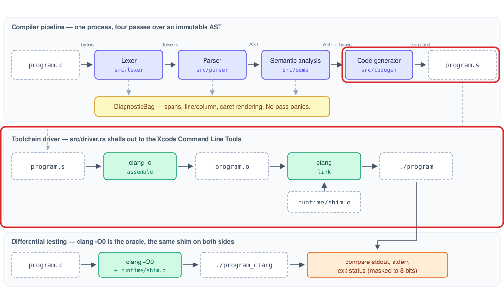

# Phase 4: ARM64 code generation and the driver

## Goal

Annotated AST to a native macOS executable, using the stack-spill strategy described in
[architecture.md](../architecture.md#code-generation).

## Outline

- [What Was](#what-was)
- [Overview](#overview)
- [Components](#components)
    - [The Emitter](#the-emitter)
    - [The Frame](#the-frame)
    - [Expression Lowering](#expression-lowering)
    - [Statement Lowering](#statement-lowering)
    - [Calls](#calls)
    - [Globals and String Data](#globals-and-string-data)
    - [The Driver](#the-driver)
    - [The Golden Corpus](#the-golden-corpus)
- [Learnings](#learnings)
- [Try It Out](#try-it-out)
- [What's Next?](#whats-next)

## What Was

[Phase 3](Phase-3-Explanation.md) left a complete front end:

- A syntax tree covering the whole subset grammar, never modified after it is built.
- Thirty-one checks that reject every program the code generator could not correctly compile.
- Annotation tables recording, against each node, the answers a backend would otherwise have to work
  out: the type of every expression, the declaration every name refers to, the implicit conversions
  C requires, what each function needs storage for, and one label per distinct string literal.

None of that produced a program. `rustycc program.c -o program` accepted its arguments, ran the
stages that existed, and exited without writing a file.

## Overview

Phase 4 turns the annotated tree into instructions a processor runs.

- An emitter owns the output format: sections, symbol names, labels, and the data directives.
- A frame layout gives every value a fixed place, which is the strategy this project chose
  ([ADR 0005](../decisions/0005-stack-spilling-instead-of-register-allocation.md)) — slower than
  deciding which values deserve registers, and without the class of bug where two live values are
  given the same one.
- Expression lowering walks each expression into instructions, with one shape running through all of
  it so that every instruction reads its operands in the order the source wrote them.
- Statement lowering adds control flow, and a stack of labels that makes `break` and `continue`
  apply to the loop that encloses them.
- Calls follow Apple's ARM64 convention, which is not quite the generic one.
- Globals and string literals reach the data sections, so a program can hold state outside a frame.
- A driver assembles and links through `clang`
  ([ADR 0009](../decisions/0009-clang-as-assembler-and-linker.md)), completing
  `rustycc program.c -o program`.
- A corpus of seven complete programs is compiled, run, and checked against what `clang` produces
  for the same source.

The part of the [architecture](../architecture.md#code-generation) this phase builds is outlined in
red:



## Components

| Component | New or extended | Role |
|---|---|---|
| [The Emitter](#the-emitter) | New | Sections, symbols, labels, and data directives |
| [The Frame](#the-frame) | New | Where every value lives, and the code that sets it up |
| [Expression Lowering](#expression-lowering) | New | Expressions to instructions |
| [Statement Lowering](#statement-lowering) | New | Control flow and the loop-context stack |
| [Calls](#calls) | New | Apple's ARM64 calling convention |
| [Globals and String Data](#globals-and-string-data) | New | The data sections |
| [The Driver](#the-driver) | New | Assembling and linking through the toolchain |
| [The Golden Corpus](#the-golden-corpus) | Extends Phase 2's corpus | Whole programs, run and checked |

### The Emitter

#### Sections (`src/codegen/emit.rs`)

```rust
pub enum Section { Text, CString, Data, Bss }

pub fn begin_function(&mut self, name: &str);
pub fn instruction(&mut self, instruction: &str);
pub fn finish(self) -> String;
```

Assembly is written into four buffers rather than one. The sections interleave in the source program
and must not interleave in the output: a function referencing a string literal is emitted while the
text section is open, and its literal belongs in `__TEXT,__cstring` at the end. `finish` concatenates
them in a fixed order and leaves out any section nothing was written into, so the result is a
function of the program rather than of the order the program was walked in.

Mach-O's conventions live here so no later part of code generation has to know them. Every C symbol
gains a leading underscore — the C function `main` is the symbol `_main` — and that happens in one
place, so no caller can forget.

> The conventions were read off `clang -O0 -S` rather than recalled, and that is a habit worth
> naming rather than a detail. Two of the answers would have been guessed wrong:
>
> - `.build_version` is not required. A file without it assembles under `clang -c -Werror` with
>   nothing at all on stderr.
> - An uninitialized global is `.zerofill`, which records a size the loader fills, rather than a run
>   of zero bytes written into the object file.

#### Labels (`src/codegen/emit.rs`)

```rust
pub fn new_label(&mut self, purpose: &str) -> String;
```

Labels are named after what they are for — `Lif_else_3`, `Lwhile_top_7` — so a snapshot diff reads as
control flow rather than as numbers. The `L` prefix is what makes a label local to the file in
Mach-O, so it never reaches the symbol table.

The counter runs across the whole file rather than restarting at each function. A restarting counter
would be just as readable and wrong: `Lif_else_1` in two functions is one name for two places, and
the assembler resolves every reference to the first.

### The Frame

#### The Layout (`src/codegen/frame.rs`)

```text
  higher addresses
  ...                        the caller's frame
  [x29, #N)                  temporaries, one per expression nesting level
  ...                        locals and spilled parameters
  [x29, #16)                 first slot
  [x29, #8]                  saved x30, the return address
  [x29, #0]   <- x29         saved x29, the caller's frame pointer
  [sp, #0)                   arguments this function passes on the stack, if any
  lower addresses
```

Every value a function needs has a fixed place, and a value is in a register only for the instant it
is being used.

`x29` sits at the bottom and every offset into the frame is positive, whatever the frame's size. The
documented prologue — `stp x29, x30, [sp, #-N]!` then `mov x29, sp` — reaches 512 bytes, and the
obvious alternative for anything larger leaves `x29` near the top with everything at negative
offsets. A compiler using one convention for small frames and the other for large ones would read a
slot from the wrong side of the frame pointer in exactly the programs least likely to be tested, so
a large frame lowers the stack pointer on its own and keeps `x29` where it was.

#### Reaching a Slot (`src/codegen/emit.rs`)

```rust
pub enum Width { Byte, Word, Double }

pub fn reaches(self, offset: u64) -> bool;
pub fn load_from_frame(&mut self, register: &str, width: Width, offset: u64);
```

An instruction carries its offset in a fixed-width field, and the field is not the same size for
every access. Each limit was put to the assembler rather than recalled: a word reaches 16380 and must
be a multiple of four, a byte reaches 4095 with no such rule, and a doubleword reaches 32760 in
multiples of eight. `ldr w0, [x29, #4098]` is rejected for the alignment alone, which a range check
by itself would have missed.

An offset that does not fit is computed into a scratch register and the access goes through that.
The alternative — handing the assembler an offset it cannot encode — is at least an error rather
than a wrong answer, but a function with enough locals is not a program this compiler should refuse.

#### Temporaries (`src/codegen/frame.rs`)

```rust
pub fn requirements(body: &Block) -> Requirements;
```

Temporaries are counted by depth rather than by quantity. Two operations side by side reuse a slot
safely, because the first has finished with it before the second starts; only nesting can collide.
So the count is the depth of the deepest expression in the function, and each nesting level gets its
own slot.

### Expression Lowering

#### The Six Steps (`src/codegen/expr.rs`)

```
        <evaluate left into w0>
        str  w0, [x29, #T]          spill left into this node's temporary
        <evaluate right into w0>
        mov  w1, w0                 right into w1
        ldr  w0, [x29, #T]          left back into w0
        sub  w0, w0, w1             every instruction reads left, right
```

One shape runs through every binary operator, whatever instruction it turns out to be.

The `mov` in the middle costs an instruction and is the reason the rest of the module is dull.
Reloading the left operand straight into `w1` would be shorter and would leave every non-commutative
instruction reading its operands backwards, so `sub`, `sdiv`, `msub` and every condition code would
each have to be written crossed. Both forms are correct when written carefully, and only one of them
fails loudly when it is not: a transposed lowering still returns the right answer for `2 - 2` and
`a < a`. Every non-commutative case in the tests is asymmetric for that reason — `10 - 3` is 7 one
way and -7 the other.

#### Specific Lowerings (`src/codegen/expr.rs`)

- A comparison is `cmp w0, w1` then `cset` with the condition code that reads the same way as the
  source operator, which follows directly from the operand convention above.
- Remainder has no instruction of its own. It is `sdiv w2, w0, w1` then `msub w0, w2, w1, w0`, where
  `msub wd, wn, wm, wa` computes `wa - wn * wm` — so the accumulator is the left operand, a second
  operand ordering to get right inside this one lowering.
- `&&` and `||` lower to real branches, so the right operand is genuinely skipped rather than
  evaluated and discarded. The result is normalized to `0` or `1` rather than being whichever
  operand decided it.
- A `char` moves with `ldrsb`/`strb`. `ldrsb` sign-extends on the way in, which is what makes C's
  rule that a `char` promotes to an `int` cost no instruction at all.

> Rust's `Option` turned a dead branch into an impossible one. `condition_code` originally returned
> `"al"` — always — for operators that are not comparisons, a branch nothing reaches:
>
> - `cset w0, al` yields 1 unconditionally, so if anything ever did reach it the result would be a
>   wrong answer that assembles.
> - Returning `Option<&'static str>` means there is no value to pick for the cases that have none,
>   and the caller has to say what it does when there is nothing to return.
> - The exhaustive `match` over `BinOp` then makes a newly added operator a build error rather than
>   something that silently compares equal.

#### Addresses and Values (`src/codegen/expr.rs`)

```rust
pub(crate) fn address_of(&mut self, expr: &Expr);
fn read_lvalue(&mut self, expr: &Expr);
```

Some expressions are asked for their value and some for where their value lives, and a few are asked
for both in different places. A local array's address is its slot's address; a decayed array
parameter's address is the pointer *stored in* its slot, because the slot holds an address rather
than the data. That distinction is the source of one of this phase's bugs, recorded in
[Learnings](#learnings).

Conversions are read out of the annotations rather than inferred. An array at an argument position
was recorded by Phase 3 as decaying, so lowering it emits an address because it was told to.

### Statement Lowering

#### Control Flow (`src/codegen/stmt.rs`)

An `if` jumps past its `else` arm rather than relying on layout — the arms are emitted one after the
other, so a `then` arm that simply ended would run the `else` arm as well.

`main`'s implicit `return 0` is emitted where control falls out of the body, immediately before the
epilogue label. An explicit `return` branches to that label and never passes through it, so the two
cannot both apply. Analysis already proved no other non-`void` function can reach its closing brace.

#### The Loop-Context Stack (`src/codegen/stmt.rs`)

```rust
pub(crate) struct LoopLabels {
    pub(crate) exit: String,
    pub(crate) next: String,
}
```

`break` and `continue` do not know which loop they are in. The generator does, because it pushes a
pair of labels on the way into a loop and pops them on the way out, so the innermost pair is the one
they find.

The two labels are not the same place, and the difference is load-bearing in a `for`: `continue` goes
to the step clause rather than to the condition. Sending it to the condition assembles perfectly well
and produces a loop that never advances, so the failure is a hang rather than a wrong answer.

### Calls

#### Apple's Convention (`src/codegen/expr.rs`)

The first eight integer or pointer arguments go in `x0`–`x7` and the return value comes back in
`w0`/`x0`, as AAPCS64 says. The ninth is where Apple's platforms differ from the generic document: a
stack argument is packed at its natural size and alignment rather than given eight bytes of its own,
so a ninth `int` occupies four bytes and is written with `str w8`.

Room for those arguments is reserved at the bottom of the caller's own frame rather than by moving
the stack pointer around each call, which keeps the stack pointer 16-byte aligned by construction
rather than by arithmetic at every call site.

#### Parking Arguments (`src/codegen/expr.rs`)

Every argument is evaluated and stored in a slot before any argument register is loaded. Doing it the
other way — place `x0`, then evaluate the next argument — loses `x0` the moment an argument is itself
a call, because that call places its own arguments in the same registers.

The slots are indexed by call nesting as well as by position, so `f(g(1), h(2))` cannot have `g`'s
arguments written over `f`'s. The test for this checks the returned value rather than watching for
side effects: C leaves the order in which arguments are evaluated unspecified, so a test watching
order could fail on a disagreement with `clang` that is not a bug.

### Globals and String Data

#### The Data Sections (`src/codegen/mod.rs`)

An initialized global is written into `__DATA,__data` at its type's width; an uninitialized one is
reserved with `.zerofill`, so a large array costs nothing in the object file. A brace list shorter
than its array zero-fills the remainder, which is what C says a partial initializer means.

Constant folding is reused rather than reimplemented: `sema::constant_value` is what decides both
whether an initializer is acceptable and what value gets written, because a second folder that
disagreed with the first would accept a program in one pass and emit something else in the other.

#### String Literals (`src/codegen/mod.rs`)

Each distinct literal is emitted once, under the label Phase 3 interned it to, so the read-only
section holds one copy of `"hello"` however many times the program writes it. The bytes are the ones
the lexer decoded; nothing here re-reads an escape from source text.

A string literal filling a `char` array is a copy of its bytes rather than a reference to them —
which is not the same as a string literal used as an argument, and getting that wrong was the other
bug this phase produced.

### The Driver

#### Assembling and Linking (`src/driver.rs`)

```rust
pub fn build(assembly: &str, output: &Path, product: Product, keep_temps: bool)
    -> Result<(), DriverError>;
```

This compiler contains neither an assembler nor a linker. It shells out to `clang` twice — once with
`-c`, once to link against the runtime shim — rather than to `as` and `ld`, because `clang` already
knows where the SDK is and which startup files a macOS executable needs.

A toolchain failure carries what the toolchain said. "clang exited with 1" tells nobody anything, so
the error holds the child's stderr and the message reads as the linker's own words. A missing
toolchain is told apart from a compilation failure and answered with `xcode-select --install`, since
it is the one failure with an obvious remedy.

> Cleanup lives in `Drop` rather than at the end of a successful run:
>
> - Most paths out of a compilation are failures, and those are the ones nobody remembers to tidy up
>   by hand.
> - Rust runs `Drop` however the scope ends — a normal return, an early `?`, a panic — so the
>   successful path and the failing ones are cleaned up by the same code rather than by six copies
>   of it.
> - `--keep-temps` opts out and prints where the files went, which is the only way to look at the
>   assembly behind a link failure.

The workspace's name carries the process id and the clock so two compilers running at once cannot
write over each other's `program.s`.

### The Golden Corpus

#### Recorded Expectations (`tests/programs/`, `tests/codegen_exec.rs`)

Each program carries the exit code and stdout it should produce in its own header. Those values were
recorded from `clang -O0 -std=c99`, not from `rustycc`: an expectation recorded from the compiler
under test is a note of what it did, not a statement of what it should do.

There is one `#[test]` per program, so a failure names the program that broke. A separate test
asserts that the test list and the directory agree, because a program added without a test would
otherwise sit in the corpus untested while the suite stayed green.

#### Two Kinds of Check (`tests/codegen_snapshots.rs`, `tests/codegen_programs.rs`)

A snapshot says what was emitted; the assembler says whether it is legal; running the program says
whether the answer is right. All three are kept separate because a change can break any one alone —
a malformed directive passes a snapshot taken after it was introduced, and a correct-but-wrong
instruction assembles perfectly.

## Learnings

1. Two bugs survived every unit test and were caught only by running whole programs, and both have
   the same shape. A decayed array parameter is an eight-byte address, and the function choosing an
   access width mapped "not one byte" to a word — so the prologue spilled the low half of the
   pointer and discarded the rest. It is a two-way branch over a domain that had quietly become
   three-valued: it cannot fail to compile, and it does not produce a wrong number, it crashes
   depending on what was left in memory. The unit tests for calls passed because a reused frame slot
   happened to still hold the right upper half.
2. The second was the same distinction in the other direction. `address_of` on a decayed parameter
   loads the address out of its slot, which is right for indexing it — and the code that reads an
   lvalue's value then loaded from that address as well, so passing the array on to another function
   passed its first element instead. `recursion.c` found it; nothing smaller did. A value whose
   meaning depends on where it is used needs the two meanings written down, which is now what the
   type of the expression decides.
3. Reading the reference implementation beat recalling the specification, repeatedly. Apple's ARM64
   platforms pack stack arguments at their natural size rather than giving each eight bytes, which
   `clang -S` shows in one line and the generic AAPCS64 document does not say. `sub sp, sp, #5008`
   does not assemble, because the immediate is twelve bits optionally shifted twelve — covering 0 to
   4095 and then only multiples of 4096, which a frame size rounded to 16 lands between almost
   always. `mov x9, #70000` is not an instruction. None of these were discovered by reasoning.
4. A test that passes immediately has not been shown to test anything. The frame's large-offset path,
   the short-circuit branches, and the argument-parking scheme were each written with a test that
   passed on its first run; each was then broken deliberately to confirm the test noticed. One of
   them did not, and was rewritten.
5. An initializer that assembles is not an initializer that works. `char g[6] = "hello"` was lowered
   by evaluating the literal as an expression — which yields the address of the read-only copy — and
   storing that into the array at the element's width, producing one byte of a pointer where the
   text should be. The corpus had that exact line in it from Phase 2.

## Try It Out

Phase 4 completes the pipeline, so a program can now be followed all the way from text to a running
executable. Run these from the repository root, with Rust and the Xcode Command Line Tools installed.

1. Build the compiler:

    ```bash
    cargo build
    ```

2. Write a program and run it:

    ```bash
    cat > /tmp/demo.c <<'EOF'
    void print_int(int n);
    void print_string(char s[]);

    int square(int n) { return n * n; }

    int main(void) {
        print_string("squares: ");
        for (int i = 1; i <= 5; i = i + 1) {
            print_int(square(i));
            print_string(" ");
        }
        return 0;
    }
    EOF
    ./target/debug/rustycc /tmp/demo.c -o /tmp/demo
    /tmp/demo
    ```

    It prints `squares: 1 4 9 16 25`. There is no preprocessor, so the program declares the three
    shim functions itself rather than including a header, and the driver links the shim in without
    being asked.

3. Look at the assembly for `square`:

    ```bash
    ./target/debug/rustycc /tmp/demo.c -S -o /tmp/demo.s
    sed -n '/_square:/,/ret/p' /tmp/demo.s
    ```

    The six-step shape is visible even though `n * n` has the same operand twice: the parameter is
    spilled into its slot by the prologue, loaded, spilled again into the multiplication's own
    temporary, loaded, moved to `w1`, and brought back into `w0` before `mul w0, w0, w1` reads left
    then right. Every offset is positive, and the `b` at the end goes to the function's single
    epilogue rather than returning from where it stands.

4. Compare against `clang` by hand, which is what Phase 5 will automate:

    ```bash
    SHIM=$(find target/debug/build -name shim.o | head -1)
    clang -O0 -std=c99 tests/programs/sorting.c "$SHIM" -o /tmp/oracle
    ./target/debug/rustycc tests/programs/sorting.c -o /tmp/ours
    diff <(/tmp/oracle) <(/tmp/ours) && echo identical
    ```

    `identical`. Every program in the corpus gives the same answer under both compilers.

5. Watch the driver clean up after itself:

    ```bash
    ./target/debug/rustycc /tmp/demo.c -o /tmp/demo --keep-temps
    ```

    It prints the directory it kept, holding the `.s` and the `.o`. Without the flag that directory
    is removed however the run ends, including when the link fails — which is exactly when looking
    at the assembly is worth doing.

6. Run the phase's tests:

    ```bash
    cargo test --test codegen_exec
    cargo test --test codegen_programs
    cargo test --lib codegen
    ```

    The first compiles every corpus program and checks it against the answer `clang` gave. The
    second runs around two hundred small programs through the whole pipeline and pins the assembly
    for each construct. The third covers the emitter and the frame arithmetic without compiling any
    C at all.

The [Cheatsheet](../CHEATSHEET.md) has more commands for exercising the backend by hand.

## What's Next?

[Phase 5](../PLAN.md#phase-5--differential-testing-fuzzing-and-system-acceptance) replaces recorded
expectations with `clang` as a live oracle, and attacks the compiler with input nobody wrote by hand.
It builds on this phase:

- The recorded exit codes and stdout in each corpus program become a comparison run: both compilers
  build the same source, both binaries run, and their outputs are compared byte for byte. Every bug
  this phase found was found that way manually, which is the argument for automating it.
- The corpus grows until every feature appears in at least three programs and every pair of features
  that can interact appears together.
- A generator produces random well-typed programs, so the corpus stops being limited by what a person
  thought to write down.
- Fuzzing drives the front end with arbitrary bytes, holding it to the no-panic invariant every pass
  has been written to keep.
